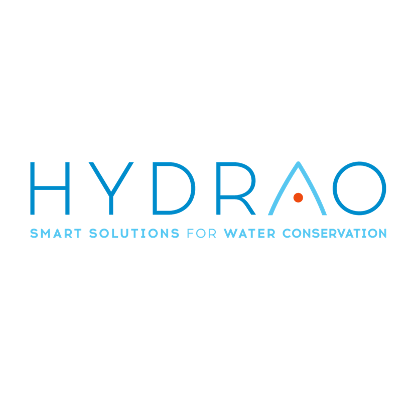
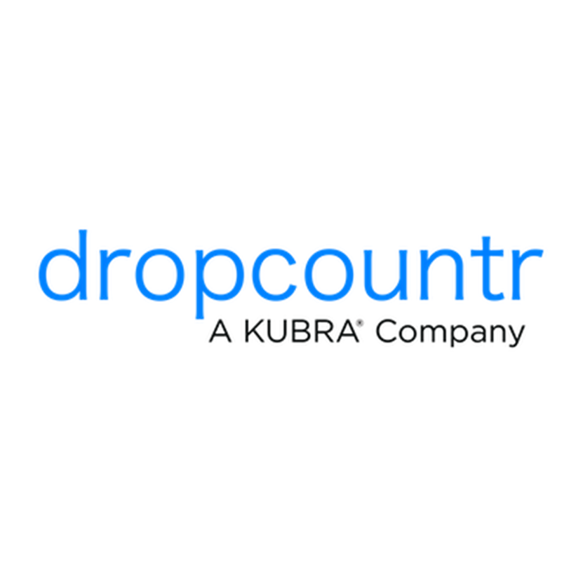
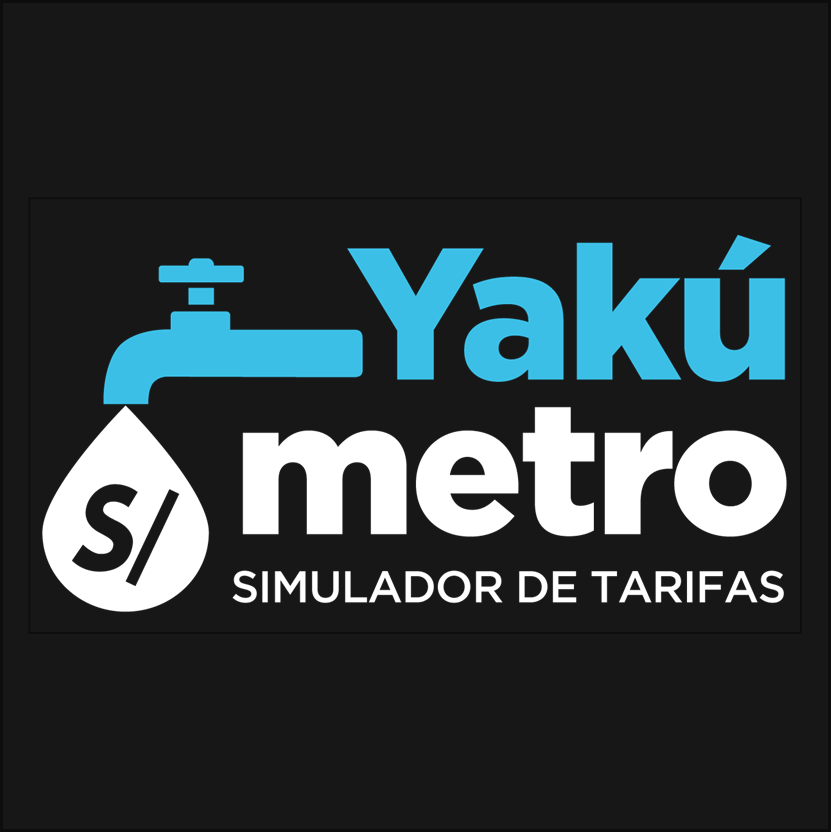
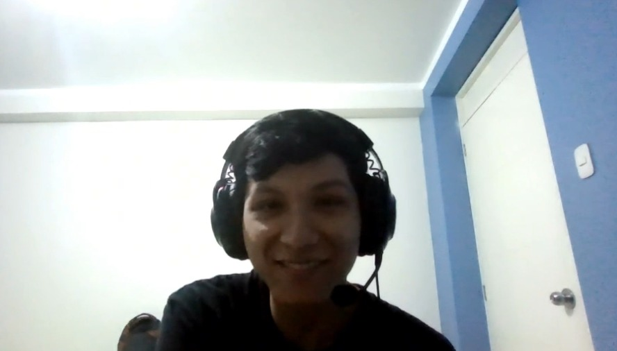

# Capítulo II: Requirements Elicitation & Analysis

## 2.1. Competidores

### 1. Hydrao

Hydrao es una startup de origen francés que fabrica duchas inteligentes. Mediante luces LED que cambian de color, sus dispositivos indican el consumo de agua en litros en tiempo real. La aplicación móvil, que es gratuita, permite consultar el historial de uso, visualizar el progreso de ahorro del hogar y establecer logros. Su uso de tecnología IoT la convierte en una referencia dentro del mercado de optimización del agua en hogares.

Su modelo de negocio incluye una aplicación gratuita; sin embargo, esta funciona únicamente con su producto físico, cuyo costo supera los 70 euros.

### 2. Dropcountr

Dropcountr es una aplicación móvil y web estadounidense que ayuda a los usuarios a monitorear, gestionar y reducir su consumo de agua. Tiene integrado un sistema IoT que interpreta datos de contadores inteligentes, lo que permite comparar el consumo con otros hogares, recibir alertas sobre posibles desperdicios y establecer presupuestos de consumo.

Un factor diferenciador de Dropcountr es su conexión con proveedores de agua. Esta integración permite que los usuarios consulten sus recibos y mantengan comunicación con las empresas prestadoras del servicio. La aplicación es gratuita para los usuarios, aunque solo está disponible para clientes de proveedores asociados con Dropcountr.

### 3. Yakumetro

Yakumetro es una iniciativa peruana desarrollada por SUNASS. Se trata de una plataforma web que funciona como simulador tarifario para calcular el consumo de agua y alcantarillado. La herramienta permite seleccionar diferentes prestadores del servicio y consultar información sobre el consumo promedio del lugar de residencia.

Asimismo, muestra datos relacionados con fugas, su equivalente económico y recomendaciones para ahorrar agua. Al ser una iniciativa de un organismo público, Yakumetro es gratuita para los usuarios.

### 2.1.1. Análisis Competitivo

El objetivo de este análisis es conocer a los competidores del mercado de gestión inteligente del agua, identificar sus fortalezas y debilidades, y determinar los puntos en los que HydroSmart puede diferenciarse. Esta comparación es especialmente relevante porque en Latinoamérica todavía existen pocas soluciones digitales consolidadas para la gestión del consumo de agua en el hogar.

<table>
	<tr>
		<th>Aspecto</th>
		<th>HydroSmart</th>
		<th>Hydrao </th>
		<th>Dropcountr </th>
		<th>Yakumetro </th>
	</tr>
	<tr>
		<td><b>Overview</b></td>
		<td>Startup peruana en etapa inicial que ofrece una plataforma digital para monitorear el consumo de agua en hogares. No necesita hardware físico y está dirigida a propietarios, arrendadores y estudiantes de Latinoamérica.</td>
		<td>Startup francesa que fabrica duchas inteligentes con luces LED que indican el consumo en tiempo real. Incluye una aplicación con historial, seguimiento del ahorro y logros.</td>
		<td>Plataforma estadounidense móvil y web que interpreta datos de contadores inteligentes para monitorear y reducir el consumo de agua.</td>
		<td>Plataforma web peruana de SUNASS que simula tarifas de agua y alcantarillado, mostrando información sobre fugas, costos y consumo promedio.</td>
	</tr>
	<tr>
		<td><b>Ventaja competitiva</b></td>
		<td>No requiere hardware y ofrece un modelo freemium adaptado al contexto latinoamericano. Incluye metas de ahorro según el presupuesto y un módulo para arrendadores.</td>
		<td>Ofrece retroalimentación visual e intuitiva en el momento del consumo, sin necesidad de abrir una aplicación.</td>
		<td>Se integra con proveedores de agua para ofrecer datos reales, historial, alertas, presupuestos y comunicación en un solo lugar.</td>
		<td>Cuenta con accesibilidad y respaldo institucional, además de información local sobre prestadores, tarifas y consumo promedio.</td>
	</tr>
	<tr>
		<td><b>Mercado objetivo</b></td>
		<td>Usuarios residenciales urbanos de Latinoamérica, inicialmente en Perú: propietarios con jardines, arrendadores y estudiantes o jóvenes inquilinos.</td>
		<td>Hogares europeos con interés en sostenibilidad y capacidad adquisitiva para comprar tecnología doméstica. También hoteles y establecimientos ecológicos.</td>
		<td>Usuarios residenciales de ciudades donde existen proveedores asociados y contadores inteligentes.</td>
		<td>Ciudadanos peruanos que desean comprender o simular su consumo y tarifa de agua.</td>
	</tr>
	<tr>
		<td><b>Estrategias de marketing</b></td>
		<td>Contenido educativo en redes sociales, modelo freemium, alianzas con administradores de edificios, inmobiliarias y proveedores de agua, y campañas con datos locales.</td>
		<td>Marketing basado en la propuesta visual y ecológica del producto, con presencia en canales digitales, ferias y tiendas especializadas.</td>
		<td>Modelo B2B2C mediante alianzas con proveedores de agua, complementado con contenido sobre sostenibilidad y ahorro económico.</td>
		<td>Difusión institucional mediante los canales de SUNASS, notas de prensa y campañas de educación ambiental.</td>
	</tr>
	<tr>
		<td><b>Productos y servicios</b></td>
		<td>Aplicación móvil y plataforma web con monitoreo, alertas, metas, historial, panel para arrendadores y recomendaciones.</td>
		<td>Ducha inteligente con luces LED y aplicación móvil para consultar historial, progreso y logros.</td>
		<td>Aplicación y plataforma web con comparativas, alertas, presupuestos y comunicación con el proveedor.</td>
		<td>Plataforma web de simulación tarifaria con datos de prestadores, fugas, consumo promedio y consejos.</td>
	</tr>
	<tr>
		<td><b>Precios y costos</b></td>
		<td>Modelo freemium. Plan Premium individual de aproximadamente S/ 15 a S/ 25 mensuales y plan Arrendador de aproximadamente S/ 40 a S/ 60 mensuales.</td>
		<td>Aplicación gratuita, condicionada a la compra de un dispositivo físico cuyo precio supera los 70 euros.</td>
		<td>Gratuita para el usuario final; los costos son asumidos por los proveedores de agua asociados.</td>
		<td>Gratuita por ser una herramienta pública de SUNASS.</td>
	</tr>
	<tr>
		<td><b>Canales de distribución</b></td>
		<td>Aplicación para App Store y Google Play, además de una plataforma web para arrendadores.</td>
		<td>Aplicación móvil condicionada a la compra del hardware, distribuido mediante la tienda oficial y comercios especializados.</td>
		<td>Aplicación móvil y plataforma web distribuidas a través de acuerdos con proveedores de agua.</td>
		<td>Plataforma web accesible desde cualquier navegador y distribuida por los canales oficiales de SUNASS.</td>
	</tr>
	<tr>
		<td><b>Fortalezas</b></td>
		<td>Bajo costo de entrada, modelo freemium, ausencia de hardware y adaptación al mercado latinoamericano.</td>
		<td>Retroalimentación visual en tiempo real y propuesta concreta en el punto donde ocurre el consumo.</td>
		<td>Gratuidad para usuarios, acceso a datos reales e integración con proveedores.</td>
		<td>Credibilidad institucional, gratuidad y datos locales detallados.</td>
	</tr>
	<tr>
		<td><b>Debilidades</b></td>
		<td>Startup nueva, recursos limitados y dependencia de la disponibilidad y precisión de los medidores existentes.</td>
		<td>Requiere hardware, monitorea principalmente la ducha y tiene una presencia concentrada en Europa.</td>
		<td>Depende totalmente de proveedores asociados y su alcance geográfico es limitado.</td>
		<td>Es un simulador estático, sin monitoreo en tiempo real ni alertas móviles.</td>
	</tr>
	<tr>
		<td><b>Oportunidades</b></td>
		<td>Mercado latinoamericano poco desarrollado, mayor conciencia ambiental, alianzas con proveedores y crecimiento del acceso a smartphones.</td>
		<td>Expansión a nuevos mercados y desarrollo de módulos adicionales de monitoreo.</td>
		<td>Expansión a nuevos proveedores y países a medida que aumente el uso de contadores inteligentes.</td>
		<td>Evolucionar hacia una plataforma con funciones en tiempo real y herramientas más completas.</td>
	</tr>
	<tr>
		<td><b>Amenazas</b></td>
		<td>Entrada de competidores con más recursos, baja cultura de pago recurrente y baja calidad de medidores en algunas zonas.</td>
		<td>El costo del hardware puede favorecer a las soluciones digitales gratuitas.</td>
		<td>Los proveedores podrían desarrollar sus propias aplicaciones o limitar el acceso a sus datos.</td>
		<td>Cambios presupuestarios o de gestión podrían retrasar su evolución tecnológica.</td>
	</tr>
</table>

### 2.1.2. Estrategias y tácticas frente a competidores

HydroSmart cuenta con una ventaja clara frente a sus competidores más cercanos: es una solución completamente digital, sin hardware, diseñada específicamente para el contexto latinoamericano. Frente a Hydrao, que requiere invertir más de 70 euros en un dispositivo físico, HydroSmart elimina esa barrera con su modelo freemium y facilita el acceso a los segmentos B y C del mercado peruano.

Frente a Dropcountr, la estrategia consiste en desarrollar alianzas tempranas con Sedapal y otros proveedores de agua del Perú. Una integración con datos de consumo locales permitiría replicar una de las principales fortalezas de Dropcountr, pero adaptada a las necesidades y tarifas del contexto peruano.

Respecto a Yakumetro, la estrategia no es competir directamente, sino diferenciarse por la profundidad de la solución. Yakumetro funciona como un simulador estático, mientras que HydroSmart ofrece gestión activa, alertas ante anomalías y metas de ahorro personalizadas. La comunicación del producto debe mostrar a HydroSmart como el siguiente paso para quienes necesitan pasar de la consulta a la gestión continua del consumo.

La táctica central debe ser crecer mediante comunidad y contenido educativo. Las redes sociales pueden explicar el costo real de las fugas, mostrar hábitos de ahorro y convertir a los usuarios satisfechos en embajadores de la aplicación. En paralelo, las alianzas institucionales deben aportar acceso a datos reales y credibilidad frente a un mercado que todavía no conoce ampliamente este tipo de soluciones.

## 2.2. Entrevistas

Con el objetivo de conocer cómo los usuarios gestionan actualmente su consumo de agua y qué dificultades enfrentan, se realizaron entrevistas dirigidas a dos grupos principales: propietarios de viviendas con áreas verdes y estudiantes que alquilan. Para cada segmento se diseñaron preguntas abiertas que permitieran comprender sus hábitos, el nivel de control sobre el gasto y su interés en utilizar soluciones tecnológicas para optimizar el uso del agua.

La información recopilada se organizó para identificar comportamientos recurrentes, problemas comunes y necesidades no cubiertas. Este análisis permitió establecer criterios para el desarrollo de HydroSmart, asegurando que la solución responda a situaciones reales y aporte valor tanto en el ahorro económico como en la gestión eficiente del recurso hídrico.

### 2.2.1. Diseño de entrevistas

Los datos básicos de los entrevistados fueron registrados mediante un formulario disponible en el siguiente enlace: [Formulario de entrevistas](https://docs.google.com/forms/d/e/1FAIpQLSeASAP7gDjpULkffOBbjQFhAo4xq-rRJhzjmd_Y2vJmM5wfVQ/viewform).

**Entrevistas del segmento 1: Propietarios de viviendas con áreas verdes**

1. ¿Podría contarnos un poco sobre su ocupación y su tipo de vivienda actual?
2. ¿Cuenta con jardín o áreas verdes en su hogar? ¿Cómo gestiona actualmente el riego?
3. ¿Qué tan importante es para usted el control del consumo de agua en su hogar?
4. ¿Con qué frecuencia revisa su recibo de agua y qué decisiones toma a partir de él?
5. ¿Ha tenido problemas con fugas o consumos elevados de agua? ¿Cómo los detectó?
6. ¿Cuáles son las mayores frustraciones que tiene respecto al consumo de agua en su vivienda?
7. ¿Ha utilizado alguna herramienta o tecnología para monitorear su consumo de agua?
8. ¿Qué aspectos considera más importantes para optimizar el uso del agua en su hogar?
9. Si existiera una aplicación que le permita ver su consumo en tiempo real, ¿cómo cree que la usaría?
10. ¿Le resultaría útil recibir alertas cuando su consumo de agua sea inusualmente alto?
11. ¿Qué tipo de información le gustaría ver en una aplicación de este tipo?
12. ¿Qué lo motivaría a usar una herramienta para controlar su consumo de agua de manera constante?
13. ¿Qué preocupaciones tendría al usar una solución tecnológica para gestionar el agua en su hogar?
14. ¿Estaría dispuesto a pagar por una solución que le ayude a reducir su consumo de agua? ¿Por qué?

**Entrevistas del segmento 2: Estudiantes que alquilan**

1. ¿Podría compartirnos su edad, a qué se dedica y su situación actual de vivienda?
2. ¿Cómo maneja su presupuesto mensual, especialmente en servicios como agua?
3. ¿Qué tan consciente es de su consumo de agua en el día a día?
4. ¿Ha tenido alguna sorpresa con el recibo de agua? ¿Cómo reaccionó?
5. ¿Cuáles son sus principales frustraciones respecto al gasto de agua?
6. ¿Qué tan seguido piensa en ahorrar agua o reducir su consumo?
7. ¿Ha intentado cambiar sus hábitos para gastar menos agua? ¿Cómo?
8. Si pudiera ver su consumo de agua en tiempo real desde su celular, ¿cree que cambiaría algo en su rutina?
9. ¿Le ayudaría recibir alertas cuando esté gastando más agua de lo normal?
10. ¿Qué tipo de información le gustaría ver en una app de consumo de agua?
11. ¿Cómo debería ser una aplicación para que realmente la use: simple, rápida u otra característica?
12. ¿Qué cosas le harían dejar de usar una app de este tipo?
13. ¿Qué tan dispuesto estaría a cambiar sus hábitos para ahorrar dinero en agua?
14. ¿Estaría dispuesto a pagar por una app que le ayude a controlar su consumo y ahorrar dinero? ¿Por qué?

### 2.2.2. Registro de entrevistas

Las entrevistas completas se encuentran en el registro identificado como [HydroSmart - entrevistas](https://shorturl.at/p85wb).

#### Segmento 1: Propietarios de viviendas con áreas verdes

**Entrevista 1: Diego Andrey Paredes Rey de Castro**

- Instante de inicio: 0 minutos y 2 segundos
- Edad: 32 años
- Ubicación: Miraflores, Lima
- Duración: 4 minutos y 42 segundos

Diego es propietario de una vivienda con áreas verdes, las cuales riega de manera interdiaria. Actualmente no presenta mayores molestias relacionadas con el consumo de agua ni con el costo del servicio. Sin embargo, le gustaría tener un mejor control del uso del agua mediante notificaciones en tiempo real que avisen si ocurre una fuga o si el consumo se eleva más de lo normal.

También muestra interés en visualizar el consumo de elementos específicos, como las llaves, y en conocer cuánto consume su regadora inteligente durante el riego. Aunque no tiene una necesidad urgente, está abierto a una solución tecnológica preventiva que le ayude a monitorear y optimizar el consumo.

**Entrevista 2: Yusnury Vivar**

- Instante de inicio: 4 minutos y 44 segundos
- Edad: 30 años
- Ubicación: San Miguel, Lima
- Duración: 4 minutos y 29 segundos

Yusnury ha enfrentado inconvenientes relacionados con fugas que no detectó a tiempo y que identificó recién al recibir un recibo mensual más elevado de lo habitual. En su vivienda cuenta con áreas verdes que riega diariamente, lo que también influye en su consumo general.

Aunque conoce prácticas básicas de ahorro, considera que no son suficientes para tener un control real. Por ello, se muestra interesada en una herramienta que le permita monitorear con precisión, prevenir fugas y reducir gastos.

**Entrevista 3: Paul Garcia Newman**

- Instante de inicio: 9 minutos y 14 segundos
- Edad: 46 años
- Ubicación: Jesús María, Lima
- Duración: 8 minutos y 43 segundos

Paul trabaja en el rubro textil y reside en una vivienda de 120 m² con un pequeño jardín frontal. Riega sus áreas verdes de forma tradicional mediante una manguera durante las noches. Aunque considera normal su consumo para las cuatro personas que habitan el hogar, anteriormente tuvo fugas difíciles de detectar en inodoros y problemas con medidores defectuosos que le generaron gastos innecesarios.

Le interesa una solución que muestre el consumo en tiempo real, compare el gasto diario con el recibo mensual y envíe alertas ante consumos inusualmente altos. También considera clave convertir los metros cúbicos consumidos directamente a soles para entender el impacto económico día a día.

#### Segmento 2: Estudiantes que alquilan

**Entrevista 1: Camila Luciana Diaz Diaz**

- Instante de inicio: 18 minutos
- Edad: 18 años
- Ubicación: San Borja, Lima
- Duración: 7 minutos y 43 segundos

Camila vive con sus hermanas y no es quien paga directamente los recibos, aunque reconoce que sus hábitos afectan la economía familiar. No piensa constantemente en el consumo, pero sus padres le han llamado la atención por excesos en actividades cotidianas. Intenta ahorrar reduciendo el tiempo de ducha y considera que una aplicación debería ser rápida, simple e intuitiva.

También valora un área informativa con consejos, recordatorios e incentivos. Estaría dispuesta a pagar después de un periodo de uso si percibe que la aplicación genera un beneficio real.

**Entrevista 2: Stephano Espinoza Cueva**

- Instante de inicio: 25 minutos y 40 segundos
- Edad: 21 años
- Ubicación: Jesús María, Lima
- Duración: 9 minutos y 47 segundos

Stephano es estudiante de la Universidad Peruana de Ciencias Aplicadas y alquila un cuarto junto a un compañero cerca de su centro de estudios. Al vivir de manera independiente, considera importante optimizar sus gastos. Aunque cree que su consumo es eficiente, ha observado sorpresas en el recibo, asociadas a pequeños excesos cotidianos.

Considera útil conocer el consumo diario y estimar el monto del recibo mensual. Le interesa una interfaz minimalista, con datos organizados y fáciles de entender, y estaría dispuesto a pagar una suscripción si la aplicación le ayuda a reducir sus gastos.

**Entrevista 3: Rodrigo Valencia**

- Instante de inicio: 35 minutos y 25 segundos
- Edad: 22 años
- Ubicación: Carabayllo, Lima
- Duración: 3 minutos y 46 segundos

Rodrigo es estudiante y profesional freelance de animación digital. Vive solo, por lo que el control de su presupuesto mensual es importante. Estima que el agua representa aproximadamente el 2% de sus ingresos, entre 20 y 30 soles, aunque ha llegado a pagar recibos inusuales de hasta 40 soles.

Considera que visualizar el consumo en tiempo real le permitiría proyectar el monto del recibo y controlar sus hábitos. Para él, las alertas de consumo excesivo son fundamentales. Prefiere una interfaz simple y directa, sin exceso de anuncios, y ve la suscripción como una inversión para evitar cobros excesivos.

### 2.2.3. Análisis de entrevistas

El análisis de las entrevistas permitió identificar patrones comunes y diferencias entre los propietarios de viviendas con áreas verdes y los estudiantes que alquilan. Ambos segmentos reconocen la importancia de controlar el consumo, pero sus motivaciones y expectativas de uso son diferentes.

| Segmento | Características | Objetivos comunes | Características subjetivas comunes |
|----------|-----------------|------------------|-----------------------------------|
| Propietarios de viviendas con áreas verdes | Personas de 30 a 60 años, con vivienda propia, jardín o áreas verdes. Utilizan smartphones, laptops y, en algunos casos, dispositivos inteligentes. | Controlar el consumo, optimizar el riego, prevenir fugas, reducir costos e incorporar tecnología en la gestión del hogar. | Motivación: tener control y evitar gastos innecesarios. Frustración: detectar fugas tarde y no contar con información clara sobre el consumo. |
| Estudiantes que alquilan | Personas de 18 a 28 años, con presupuesto limitado, que viven solos o comparten vivienda. Utilizan smartphones, aplicaciones móviles y redes sociales. | Reducir gastos, controlar el consumo, evitar conflictos con compañeros, adoptar hábitos de ahorro y utilizar soluciones simples. | Motivación: ahorrar dinero y mejorar la convivencia. Frustración: no saber dónde se produce el gasto y recibir cobros inesperados. |

Los propietarios valoran principalmente la prevención de fugas, el control del riego y la conversión del consumo a un costo económico. Los estudiantes priorizan una interfaz sencilla, alertas oportunas, proyecciones del recibo y herramientas que les permitan mantenerse dentro de su presupuesto.

## 2.3. Needfinding

El proceso de Needfinding se centró en comprender las necesidades, hábitos y dificultades de los dos segmentos objetivo: propietarios de viviendas con áreas verdes y estudiantes que alquilan. A partir de las entrevistas se identificaron comportamientos compartidos y diferencias importantes en la forma en que cada grupo gestiona y percibe el consumo de agua.

### Necesidades identificadas en propietarios

- Visualizar el consumo de agua en tiempo real.
- Recibir alertas cuando se detecten fugas o consumos inusualmente altos.
- Controlar el consumo de las áreas verdes y de dispositivos de riego.
- Comparar el consumo diario con el recibo mensual.
- Convertir los metros cúbicos consumidos a soles.
- Recibir información clara para prevenir gastos innecesarios.

### Necesidades identificadas en estudiantes que alquilan

- Consultar el consumo desde el celular de forma rápida.
- Obtener una estimación del monto del recibo al finalizar el mes.
- Establecer límites o metas de consumo según su presupuesto.
- Recibir recordatorios y alertas que ayuden a cambiar hábitos.
- Acceder a una interfaz minimalista, organizada y fácil de entender.
- Evitar anuncios excesivos y funciones que dificulten el uso.

### Hallazgos priorizados

1. **Visibilidad en tiempo real:** ambos segmentos necesitan conocer cuánto consumen antes de recibir el recibo mensual.
2. **Prevención de fugas:** los propietarios reportan experiencias directas con fugas que fueron detectadas tarde, mientras que los estudiantes necesitan alertas para evitar cobros inesperados.
3. **Traducción a impacto económico:** mostrar el consumo en soles facilita que los usuarios comprendan el valor de modificar sus hábitos.
4. **Simplicidad de uso:** la interfaz debe ser rápida, minimalista y comprensible para favorecer el uso constante.
5. **Metas y recomendaciones:** los usuarios necesitan orientación accionable para reducir el consumo y comprobar su progreso.

En conjunto, los hallazgos evidencian una oportunidad para desarrollar una plataforma que combine monitoreo, alertas, metas y recomendaciones personalizadas. Los propietarios requieren mayor profundidad en el control del hogar y del riego, mientras que los estudiantes necesitan una experiencia directa orientada al presupuesto. Estas necesidades servirán como base para construir los perfiles de usuario, tareas y mapas de experiencia de la siguiente mitad del capítulo.

### 2.3.1. User Personas

En esta fase se elaboraron perfiles ficticios, denominados User Personas, que condensan los rasgos más significativos de los usuarios identificados durante el análisis de las entrevistas aplicadas. Este recurso hace posible traducir los datos obtenidos en representaciones concretas y prácticas, capaces de guiar el proceso de diseño y respaldar las decisiones vinculadas a las funcionalidades y a la experiencia de uso. En el marco del proyecto se establecieron dos perfiles centrales: el primero orientado a dueños de viviendas que cuentan con áreas verdes y el segundo a estudiantes en situación de alquiler.

Anexo Diagrama User Persona: https://goo.su/3jV074Q

**Segmento 1: Propietarios de viviendas con áreas verdes**

**Segmento 2: Estudiantes que alquilan**

