# Capítulo IV: Product Architecture Design

## 4.1 Design Concepts, ViewPoints & ER Diagrams

### 4.1.1 Principles Statements

A partir de la visión de negocio de HydroSmart (transformar el consumo de agua doméstico en información accionable en tiempo real que permita a los propietarios y estudiantes prevenir fugas, optimizar el riego y ahorrar dinero) y de la visión arquitectónica de construir una plataforma escalable, segura y de baja latencia capaz de procesar datos provenientes de sensores IoT de forma continua, se definen los siguientes principios generales que guían todas las decisiones de diseño y evolución del sistema a largo plazo:

*   **Comunicación asincrónica sobre sincrónica:** La ingesta de lecturas de consumo (caudal de agua) y la generación de alertas se basan en mecanismos no bloqueantes y orientados a eventos. Se emplea un Message Broker para desacoplar la recepción de telemetría de los sensores del procesamiento de anomalías y la actualización de analíticas, evitando que picos de lecturas (por ejemplo, en horas punta de riego) degraden la experiencia del usuario.
*   **Uso de bibliotecas y frameworks con soporte comercial o comunidad activa:** Se priorizan tecnologías con ciclos de actualización claros y ecosistemas maduros. La autenticación se delega a Firebase Authentication; las notificaciones push se gestionan mediante Firebase Cloud Messaging; el procesamiento de pagos de suscripciones se delega a una pasarela como Stripe o Culqi y la documentación de API se estandariza bajo OpenAPI 3.1. Este principio garantiza la sostenibilidad técnica del proyecto a largo plazo.
*   **Monitoreo en tiempo real como eje central del diseño:** La lectura y el procesamiento del consumo hídrico constituyen el activo principal de la plataforma. Todos los servicios que involucran visualización de consumo, detección de fugas y generación de recomendaciones se diseñan priorizando la baja latencia entre la lectura del sensor y la notificación al usuario, por encima de cualquier otra consideración de rendimiento.
*   **Seguridad como principio transversal:** La seguridad se aplica en cada componente del sistema, no como una capa adicional. Se delega la gestión de identidad a Firebase Authentication, se valida el rol del usuario (propietario, inquilino o administrador) en cada petición, y el acceso a los datos de consumo de una unidad o vivienda queda restringido exclusivamente a su propietario o administrador autorizado.
*   **Dominio sobre implementación técnica (DDD):** El diseño parte del modelo de negocio y no de los detalles técnicos. Se aplica Domain-Driven Design para organizar el sistema en Bounded Contexts claros: Gestión de Identidad (IAM), Propiedades y Unidades, Consumo y Telemetría, Alertas y Notificaciones, Ahorro y Recomendaciones, Analíticas y Reportes, y Suscripciones. Cada contexto evoluciona de forma independiente sin comprometer la coherencia del sistema.
*   **Integridad y trazabilidad de las lecturas de consumo:** La lectura de consumo es el invariante más crítico de la plataforma: una pérdida o duplicación de datos afecta directamente la confianza del usuario en las alertas y en los reportes de ahorro. Toda lectura recibida desde un sensor se procesa de forma idempotente (evitando conteos duplicados ante reenvíos de red) y se persiste de manera transaccional antes de publicar cualquier evento derivado.
*   **Separación de responsabilidades mediante arquitectura en capas:** El sistema se estructura en capas claras: presentación, aplicación, dominio e infraestructura, separando la lógica de negocio de los frameworks, los proveedores externos y los mecanismos de persistencia. El patrón Repository abstrae el acceso a datos de las reglas del dominio, facilitando cambios en la capa de persistencia sin afectar la lógica de negocio.
*   **Escalabilidad progresiva:** La arquitectura de microservicios y el enfoque orientado a eventos se implementan de forma incremental, priorizando primero los flujos más críticos (registro de consumo y alertas de fuga). Se evita introducir complejidad innecesaria en etapas tempranas del desarrollo, optando por soluciones simples y mantenibles que puedan escalar cuando el número de sensores y usuarios lo justifique.
*   **Frontend desacoplado con contrato de API explícito:** La aplicación web y móvil consumen APIs RESTful expuestas por los servicios backend mediante un único punto de entrada centralizado en el API Gateway. Este principio desacopla el frontend de la implementación interna de los servicios y facilita la futura integración con aplicaciones móviles nativas o con dispositivos adicionales.
*   **Delegación de responsabilidades no esenciales a servicios externos:** Funcionalidades que no forman parte del núcleo diferencial de HydroSmart (como autenticación, envío de notificaciones push, procesamiento de pagos y almacenamiento de imágenes de perfil) se delegan a proveedores externos confiables (Firebase, pasarela de pagos, servicio de almacenamiento en la nube). Esto reduce la complejidad interna del sistema y permite al equipo enfocarse en los subdominios de mayor valor: el monitoreo hídrico y la detección temprana de anomalías.

### 4.1.2 Approaches Statements Architectural Styles & Patterns

Para el desarrollo de HydroSmart se adopta un enfoque arquitectónico orientado a la escalabilidad, el procesamiento en tiempo real y la alta disponibilidad, debido a la naturaleza continua de los datos generados por los sensores de consumo de agua y a la necesidad de notificar anomalías (fugas, consumos excesivos) de forma casi inmediata.

Como principio rector, se emplea una arquitectura basada en **Domain-Driven Design (DDD)**, permitiendo modelar de forma precisa los subdominios clave del sistema: Gestión de Identidad, Propiedades y Unidades, Consumo y Telemetría, Alertas y Notificaciones, Ahorro y Recomendaciones, Analíticas y Reportes, y Suscripciones. Este enfoque facilita la alineación entre la lógica de negocio y la implementación técnica, promoviendo un lenguaje ubicuo entre los distintos perfiles de usuario (propietarios e inquilinos) y el equipo de desarrollo.

El sistema se organiza mediante **Bounded Contexts**, delimitando claramente las responsabilidades de cada subdominio. Esto permite desacoplar funcionalidades críticas como la ingesta de telemetría, el cálculo de alertas y la generación de recomendaciones, favoreciendo la mantenibilidad y la evolución independiente de cada componente.

**Estilos arquitectónicos**

El estilo arquitectónico predominante es una **arquitectura basada en microservicios**, complementada con un enfoque **orientado a eventos (Event-Driven Architecture)** para el procesamiento de la telemetría en tiempo real, sin introducir complejidad innecesaria en las primeras iteraciones.

- Cada microservicio es responsable de un dominio específico (identidad, propiedades, consumo, alertas, ahorro, analíticas, suscripciones), permitiendo escalar de forma independiente según la demanda.
- El uso de eventos permite gestionar de manera eficiente acciones críticas como el registro de una nueva lectura de consumo, la detección de una anomalía y la actualización de las métricas del dashboard, sin acoplar estos procesos entre sí.
- Se emplea un **Message Broker** (por ejemplo, RabbitMQ) para la comunicación asíncrona entre servicios, facilitando el manejo de eventos como `ConsumptionRecorded` y `LeakDetected`.
- Los sensores/medidores inteligentes envían sus lecturas mediante un protocolo ligero orientado a IoT (por ejemplo, MQTT) hacia un gateway de ingesta, el cual traduce y reenvía la información al microservicio de Consumo y Telemetría a través de eventos internos.
- Para la gestión de autenticación y seguridad, se integra un servicio externo como Firebase Authentication, delegando la responsabilidad de identidad y acceso.

Adicionalmente, para optimizar la interacción con el usuario final, se emplea un enfoque de **cliente-servidor con frontend desacoplado**, donde la aplicación web y móvil consumen APIs RESTful expuestas por los servicios backend a través de un único API Gateway.

**Patrones de diseño y procesamiento**

Para garantizar el cumplimiento de los atributos de calidad del sistema sin introducir complejidad innecesaria, se adoptan los siguientes patrones de diseño:

- **API Gateway Pattern:** centraliza el acceso al backend mediante un único punto de entrada, encargado de manejar autenticación, enrutamiento y validaciones básicas antes de que la petición llegue a los microservicios internos.
- **MVC (Model-View-Controller):** utilizado en la organización del backend para separar la lógica de negocio (Model), la gestión de solicitudes (Controller) y la representación de datos (View/API Response).
- **Repository Pattern:** permite abstraer el acceso a la base de datos, evitando el acoplamiento directo con la lógica de negocio y facilitando cambios en la capa de persistencia (por ejemplo, si se migra el almacenamiento de lecturas a una base optimizada para series de tiempo).
- **Adapter Pattern:** aplicado para integrar servicios externos como Firebase (autenticación y notificaciones push), la pasarela de pagos y el gateway de sensores IoT, traduciendo sus formatos particulares al modelo interno de HydroSmart.
- **Observer Pattern (Eventos de Dominio):** implementa el mecanismo para reaccionar a cambios críticos. Cuando se registra una nueva lectura de consumo, este evento "notifica" a los componentes de Alertas y de Analíticas para que actualicen el estado del sistema en paralelo, manteniendo un bajo acoplamiento entre módulos.
- **Idempotent Consumer:** aplicado en el servicio de Consumo y Telemetría para evitar que reenvíos de un mismo sensor (por fallas de red) dupliquen una lectura y distorsionen el consumo real o disparen alertas falsas.
- **CQRS (Command Query Responsibility Segregation):** separa las operaciones que alteran el estado (por ejemplo, `RegisterConsumptionCommand`) de las que solo consultan información (por ejemplo, `GetDashboardSummaryQuery`), optimizando las consultas masivas del historial y el dashboard sin ser afectadas por la escritura constante de nuevas lecturas.
- **Validación en Backend (Fail Fast):** se validan los datos en cada solicitud (rol de usuario, rangos de fechas, umbrales de alerta), evitando estados inconsistentes.
- **RESTful API Design:** se adoptan buenas prácticas en el diseño de APIs REST, con endpoints claros, métodos HTTP adecuados y estructuras de respuesta consistentes, facilitando la interoperabilidad con el frontend y con futuras integraciones (por ejemplo, con proveedores de agua como SEDAPAL).

La combinación de Domain-Driven Design (DDD), arquitectura de microservicios y un enfoque de Event-Driven Architecture (EDA) permite que HydroSmart procese de forma eficiente el flujo continuo de lecturas de consumo, detecte anomalías con baja latencia y mantenga la consistencia en operaciones críticas como el cálculo de alertas y proyecciones de gasto, sin introducir complejidad innecesaria en las primeras iteraciones del proyecto.

### 4.1.3 Context Diagram

El diagrama de contexto de HydroSmart representa la vista más general del sistema, permitiendo identificar claramente los límites que lo separan de su entorno externo. Este diagrama describe las interacciones entre los actores principales y los servicios externos que se integran con la plataforma, proporcionando una visión global de los flujos de información y los puntos de integración tecnológica.

En primer lugar, se identifican los actores principales que interactúan directamente con el sistema. Los **propietarios de viviendas con áreas verdes** utilizan la plataforma para monitorear su consumo en tiempo real, optimizar el riego de sus jardines y recibir alertas ante posibles fugas. Los **estudiantes y jóvenes arrendatarios** usan la plataforma para controlar su gasto diario, establecer metas de ahorro adaptadas a su presupuesto y evitar cobros inesperados. Finalmente, los **administradores del sistema** cumplen un rol de supervisión operativa y soporte de la plataforma.

Asimismo, HydroSmart interactúa con servicios externos especializados que complementan su funcionalidad principal. Se integra **Firebase Authentication**, el cual gestiona el registro e inicio de sesión de los usuarios mediante mecanismos seguros de autenticación, delegando la gestión de credenciales y reduciendo la complejidad interna del sistema. Los **sensores IoT / medidores inteligentes de caudal** envían de forma continua sus lecturas hacia la plataforma, constituyendo la fuente primaria de datos del sistema. Cada vivienda o unidad cuenta, como mínimo, con un medidor **GENERAL** instalado en el punto de suministro de agua (el mismo que reporta el consumo facturable por la empresa prestadora); el desglose de consumo por zona (riego, cocina, baño) que ve el usuario en el dashboard solo está disponible cuando este instala medidores IoT adicionales en dichos puntos, dado que un único medidor general registra el caudal total y no puede atribuirlo a una zona específica de la vivienda. Para notificar al usuario ante consumos inusuales o fugas detectadas, el sistema se apoya en un **servicio de notificaciones push (Firebase Cloud Messaging)**. Por otro lado, para el modelo de monetización mediante planes de suscripción (Freemium, Premium), HydroSmart se integra con una **pasarela de pagos** (Stripe o Culqi) que procesa las transacciones de forma segura. Finalmente, se considera un **servicio de almacenamiento en la nube** para la gestión de imágenes de perfil de los usuarios.

La incorporación de estos servicios externos responde a principios arquitectónicos de desacoplamiento y especialización, delegando funcionalidades no críticas a proveedores externos confiables. Esto permite reducir la complejidad interna del sistema, mejorar la seguridad (especialmente en la gestión de autenticación y pagos) y optimizar el rendimiento general de la plataforma.

En conjunto, el diagrama de contexto muestra que HydroSmart actúa como el núcleo central que traduce las lecturas de consumo de agua en información accionable para sus dos segmentos de usuario, mientras delega funciones específicas como autenticación, notificaciones y pagos a servicios externos especializados.

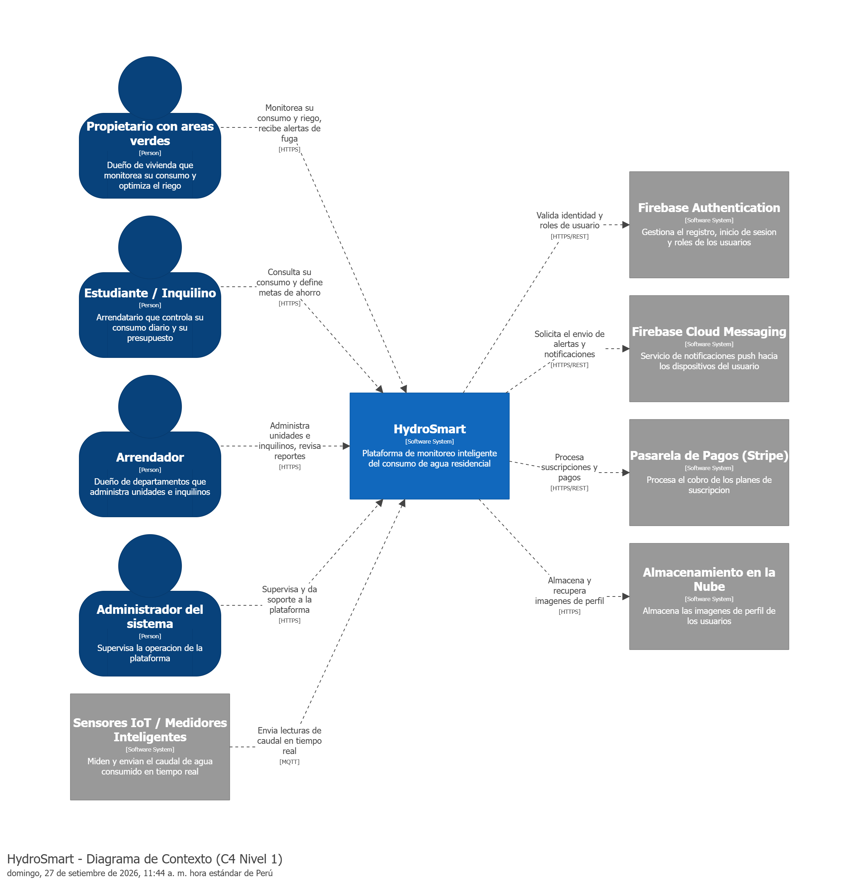

### 4.1.4 Approach driven ViewPoints Diagrams
Se presenta el diagrama de secuencia que describe el flujo principal cuando un sensor reporta una lectura de consumo y el sistema detecta una posible anomalía (fuga o consumo excesivo), notificando al usuario en tiempo real. El diagrama organiza las acciones en función de los bounded contexts más relevantes del sistema: **Identity & Access Management (IAM)**, **Consumption & Telemetry**, **Alerts & Notifications** y **Analytics & Reports**.

El flujo se inicia en el bounded context **IAM**, donde el usuario accede a la plataforma web o móvil y realiza el proceso de autenticación mediante correo y contraseña utilizando Firebase Authentication. Una vez autenticado, el sistema valida el rol del usuario (propietario o inquilino) y concede acceso a las funcionalidades correspondientes a su vivienda o unidad.

De manera independiente y continua, el bounded context **Consumption & Telemetry** recibe las lecturas de caudal enviadas por el medidor GENERAL de la vivienda (y, si el usuario instaló medidores adicionales, también por los medidores de zona). El servicio valida la lectura, la procesa de forma idempotente para evitar duplicados y la persiste, publicando un evento de dominio `ConsumptionRecorded` hacia el Message Broker.

A continuación, el flujo se ramifica hacia dos consumidores del evento. Por un lado, el bounded context **Alerts & Notifications** evalúa la lectura recibida contra los umbrales configurados por el usuario (o contra un patrón de consumo continuo fuera de lo habitual, indicativo de una fuga). Si detecta una anomalía, genera un evento `LeakDetected` y solicita al servicio externo de notificaciones push que envíe una alerta inmediata al usuario, indicando la posible causa y, únicamente cuando la lectura anómala proviene de un medidor de zona instalado por el usuario, la zona aproximada donde se originó; si solo se cuenta con el medidor GENERAL, la alerta se reporta de forma general para todo el domicilio, ya que un único medidor no permite inferir en qué punto de la vivienda ocurre la fuga. Por otro lado, el bounded context **Analytics & Reports** consume el mismo evento para actualizar en tiempo real el dashboard del usuario, recalcular la proyección de gasto mensual y verificar el avance respecto a su meta de ahorro.

Finalmente, el usuario visualiza en su dashboard tanto la alerta recibida como el consumo actualizado, pudiendo ajustar su comportamiento (por ejemplo, revisar el riego o reportar la fuga) o modificar su meta de ahorro para el siguiente periodo.

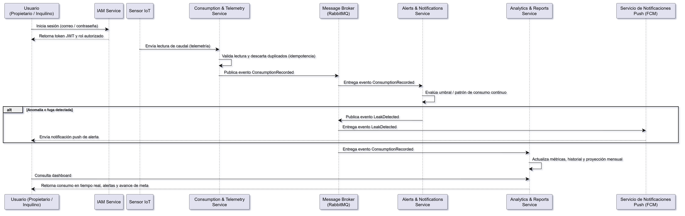

### 4.1.5 Relational/Non Relational Database Diagram

En esta sección se presentan los diagramas de base de datos que soportan la persistencia de cada bounded context de HydroSmart. En coherencia con el constraint R03 (cada bounded context gestiona su propia base de datos) y el constraint R08 (separación entre persistencia transaccional y persistencia de telemetría), la solución adopta un modelo de **persistencia poliglota**: las entidades de negocio con relaciones estructuradas y baja tasa de escritura se modelan de forma relacional en MySQL, mientras que el flujo continuo e inmutable de lecturas de los sensores se modela como documentos en MongoDB, optimizados para escritura masiva y consulta por rango de tiempo.

**Estimación de volumetría de telemetría**

Antes de justificar la elección de MongoDB para las lecturas, se dimensiona la carga esperada tomando como base la meta de crecimiento de 800 usuarios activos definida en el Escenario 5 (sección 4.2.3) y un promedio estimado de 1.5 medidores por usuario (considerando que toda unidad tiene un medidor GENERAL obligatorio, que algunos usuarios instalan medidores IoT adicionales por zona —por ejemplo RIEGO— para obtener el desglose granular descrito en la sección 4.2.4, y que algunos usuarios administran más de una unidad, cada una con al menos un medidor):

| Parámetro | Valor estimado |
|---|---|
| Usuarios activos (meta) | 800 |
| Medidores activos estimados (800 × 1.5) | 1 200 |
| Frecuencia de envío por medidor | 1 lectura cada 30 segundos (2 lecturas/min) |
| Lecturas por minuto | 1 200 × 2 = 2 400 |
| Lecturas por hora | 144 000 |
| Lecturas por día | ≈ 3.46 millones |
| Lecturas por mes (30 días) | ≈ 103.7 millones |
| Lecturas por año | ≈ 1 261 millones |
| Peso estimado por documento BSON (meterId, timestamp, volumeLiters, instantFlowRate, accumulatedLiters + overhead de índices) | ≈ 200 bytes |
| Almacenamiento crudo estimado por día | ≈ 0.69 GB |
| Almacenamiento crudo estimado por mes | ≈ 20.7 GB |
| Almacenamiento crudo estimado por año | ≈ 250 GB (sin comprimir) |

Este volumen (2 400 lecturas/min en operación estable, con margen hasta las 20 000 lecturas/min soportadas según el Escenario 5) confirma que una base de datos relacional tradicional no es adecuada como almacén primario de lecturas crudas, ya que el costo de mantener índices B-Tree sobre una tabla que crece en cientos de millones de filas por año degradaría el rendimiento de escritura. Por ello, MongoDB almacena las lecturas crudas como series de tiempo, y el bounded context de Analíticas y Reportes consolida agregados diarios en MySQL (patrón CQRS, ya descrito en 4.1.2), aplicando además la política de retención de lecturas crudas por plan de suscripción mencionada en el Architectural Concern 9 (sección 4.2.5) para controlar el crecimiento indefinido del volumen estimado.

**Vinculación Medidor – Propiedad – Unidad – Usuario**

Uno de los aspectos más críticos del modelo de datos es garantizar la trazabilidad completa entre el usuario propietario, la propiedad que posee, la unidad habitacional (y su inquilino asignado, de existir) y el medidor físico que reporta el consumo, ya que de esta cadena depende tanto el control de acceso (R01) como la facturación y las alertas por unidad. Esta cadena atraviesa dos bounded contexts: **Gestión de Identidad (IAM)** y **Propiedades y Unidades**, y su estado se replica de forma asíncrona hacia **Consumo y Telemetría** para que este último no dependa de llamadas síncronas en el camino crítico de ingesta.

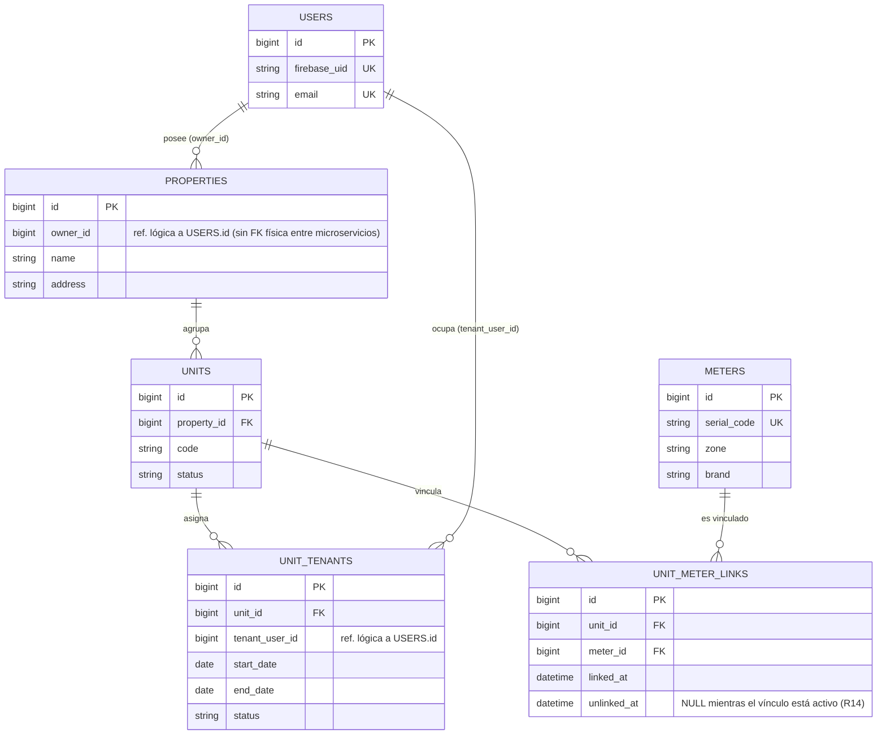
```mermaid
erDiagram
    USERS ||--o{ PROPERTIES : "posee (owner_id)"
    PROPERTIES ||--o{ UNITS : "agrupa"
    UNITS ||--o{ UNIT_TENANTS : "asigna"
    USERS ||--o{ UNIT_TENANTS : "ocupa (tenant_user_id)"
    UNITS ||--o{ UNIT_METER_LINKS : "vincula"
    METERS ||--o{ UNIT_METER_LINKS : "es vinculado"

    USERS {
        bigint id PK
        string firebase_uid UK
        string email UK
    }
    PROPERTIES {
        bigint id PK
        bigint owner_id "ref. lógica a USERS.id (sin FK física entre microservicios)"
        string name
        string address
    }
    UNITS {
        bigint id PK
        bigint property_id FK
        string code
        string status
    }
    UNIT_TENANTS {
        bigint id PK
        bigint unit_id FK
        bigint tenant_user_id "ref. lógica a USERS.id"
        date start_date
        date end_date
        string status
    }
    METERS {
        bigint id PK
        string serial_code UK
        string zone
        string brand
    }
    UNIT_METER_LINKS {
        bigint id PK
        bigint unit_id FK
        bigint meter_id FK
        datetime linked_at
        datetime unlinked_at "NULL mientras el vínculo está activo (R14)"
    }
```

El constraint R14 (un medidor solo puede estar vinculado a una unidad a la vez) se implementa mediante la tabla `unit_meter_links`, exigiendo `unlinked_at IS NULL` como condición de unicidad activa por `meter_id`. Este vínculo es propiedad del bounded context **Propiedades y Unidades** (allí se registra y se rompe la asociación cuando el propietario reemplaza un medidor o desvincula una unidad), pero **Consumo y Telemetría** necesita conocerlo en cada lectura sin incurrir en una llamada síncrona. Por ello, cuando se registra o modifica un vínculo se publica el evento de dominio `MeterLinkedToUnit` / `MeterUnlinked`, que Consumo y Telemetría consume para mantener una réplica local de solo lectura (`meter_references`) con `meter_id`, `unit_id_ref`, `property_id_ref` y `owner_user_id_ref`, siguiendo el mismo patrón de réplicas asíncronas vía eventos aplicado entre los demás bounded contexts del sistema.

**Microservicio: Gestión de Identidad (IAM)**

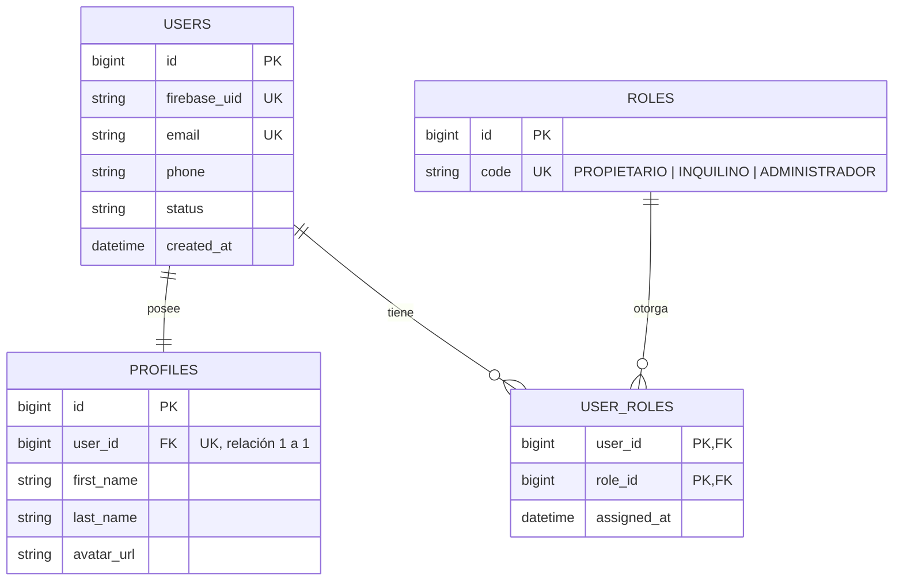
```mermaid
erDiagram
    USERS ||--|| PROFILES : "posee"
    USERS ||--o{ USER_ROLES : "tiene"
    ROLES ||--o{ USER_ROLES : "otorga"

    USERS {
        bigint id PK
        string firebase_uid UK
        string email UK
        string phone
        string status
        datetime created_at
    }
    PROFILES {
        bigint id PK
        bigint user_id FK "UK, relación 1 a 1"
        string first_name
        string last_name
        string avatar_url
    }
    ROLES {
        bigint id PK
        string code UK "PROPIETARIO | INQUILINO | ADMINISTRADOR"
    }
    USER_ROLES {
        bigint user_id PK,FK
        bigint role_id PK,FK
        datetime assigned_at
    }
```

La base de datos de IAM se implementa en MySQL y no persiste contraseñas: `users.firebase_uid` es la única referencia a Firebase Authentication (constraint R01), garantizando que la validación de credenciales se delegue completamente al proveedor externo. La relación `users`–`profiles` es uno a uno y separa el dato de autenticación del dato biográfico. La asignación de roles es muchos a muchos mediante `user_roles`, lo que permite que un mismo usuario acumule más de un rol (por ejemplo, ser propietario de una vivienda e inquilino en otra), sin necesidad de duplicar su cuenta.

**Microservicio: Propiedades y Unidades**

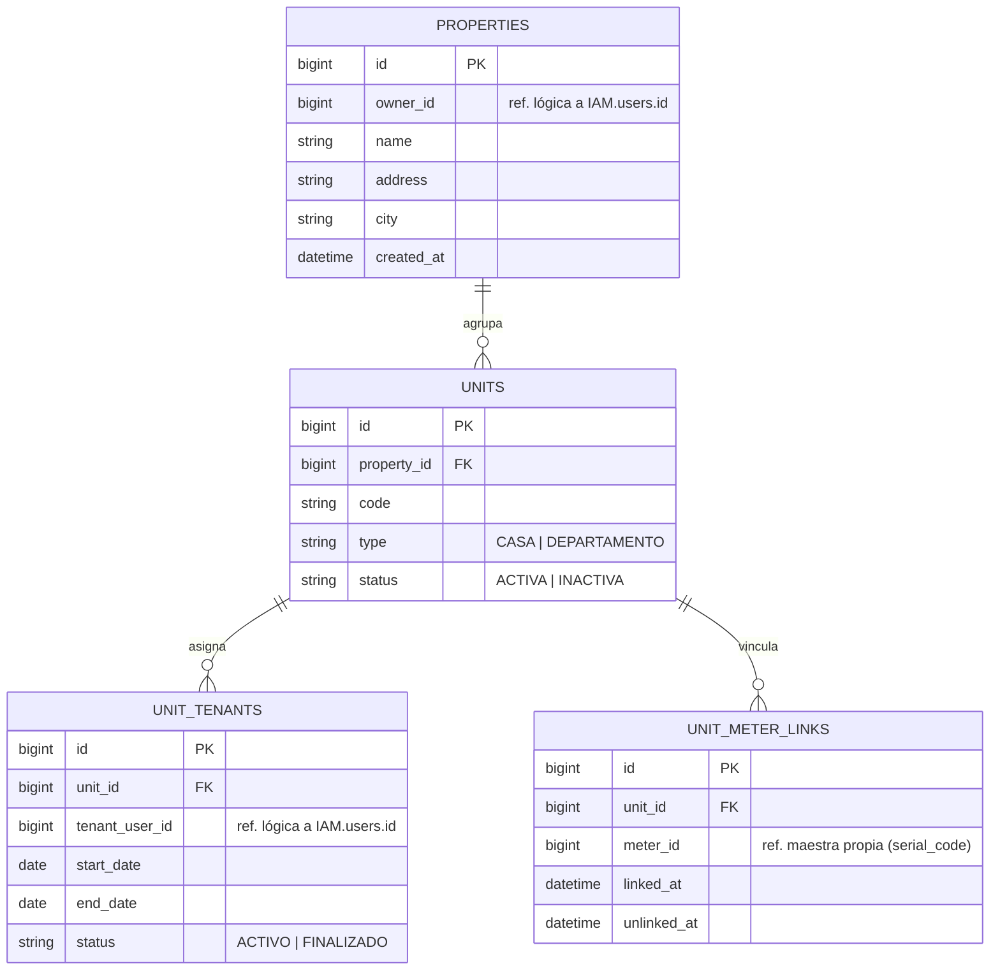
```mermaid
erDiagram
    PROPERTIES ||--o{ UNITS : "agrupa"
    UNITS ||--o{ UNIT_TENANTS : "asigna"
    UNITS ||--o{ UNIT_METER_LINKS : "vincula"

    PROPERTIES {
        bigint id PK
        bigint owner_id "ref. lógica a IAM.users.id"
        string name
        string address
        string city
        datetime created_at
    }
    UNITS {
        bigint id PK
        bigint property_id FK
        string code
        string type "CASA | DEPARTAMENTO"
        string status "ACTIVA | INACTIVA"
    }
    UNIT_TENANTS {
        bigint id PK
        bigint unit_id FK
        bigint tenant_user_id "ref. lógica a IAM.users.id"
        date start_date
        date end_date
        string status "ACTIVO | FINALIZADO"
    }
    UNIT_METER_LINKS {
        bigint id PK
        bigint unit_id FK
        bigint meter_id "ref. maestra propia (serial_code)"
        datetime linked_at
        datetime unlinked_at
    }
```

`properties.owner_id` y `unit_tenants.tenant_user_id` son referencias lógicas (no llaves foráneas físicas) hacia la base de datos de IAM, dado que cada microservicio administra su propio esquema (R03); la validez de estas referencias se comprueba en tiempo de escritura mediante el patrón Facade/ACL descrito en 4.1.6, y no mediante integridad referencial de base de datos entre esquemas distintos.

**Microservicio: Consumo y Telemetría**

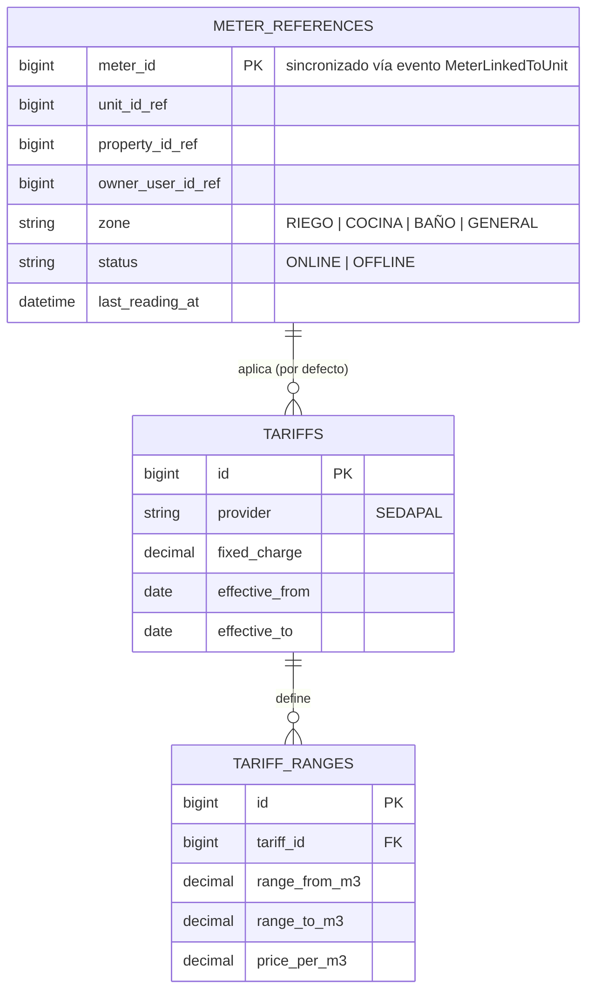
```mermaid
erDiagram
    METER_REFERENCES ||--o{ TARIFFS : "aplica (por defecto)"
    TARIFFS ||--o{ TARIFF_RANGES : "define"

    METER_REFERENCES {
        bigint meter_id PK "sincronizado vía evento MeterLinkedToUnit"
        bigint unit_id_ref
        bigint property_id_ref
        bigint owner_user_id_ref
        string zone "RIEGO | COCINA | BAÑO | GENERAL"
        string status "ONLINE | OFFLINE"
        datetime last_reading_at
    }
    TARIFFS {
        bigint id PK
        string provider "SEDAPAL"
        decimal fixed_charge
        date effective_from
        date effective_to
    }
    TARIFF_RANGES {
        bigint id PK
        bigint tariff_id FK
        decimal range_from_m3
        decimal range_to_m3
        decimal price_per_m3
    }
```

Este esquema relacional (MySQL) almacena únicamente metadatos de bajo volumen: la réplica de medidores (`meter_references`, descrita en el punto anterior) y las tarifas parametrizadas y versionadas por fecha de vigencia (Escenario 13, sección 4.2.3), evitando así codificar la estructura tarifaria como lógica de programa. Solo el medidor de zona `GENERAL` es obligatorio por unidad y el único cuyo `accumulatedLiters` alimenta el cálculo tarifario oficial (R12); los medidores `RIEGO`, `COCINA` y `BAÑO` son opcionales y dependen de que el usuario los instale físicamente (R02), por lo que el desglose de consumo por zona en el dashboard solo se muestra para las zonas que efectivamente tengan un `meter_id` vinculado en `meter_references`. Las lecturas propiamente dichas —el dato de alto volumen dimensionado en la estimación de volumetría— se modelan como documentos no relacionales en MongoDB:

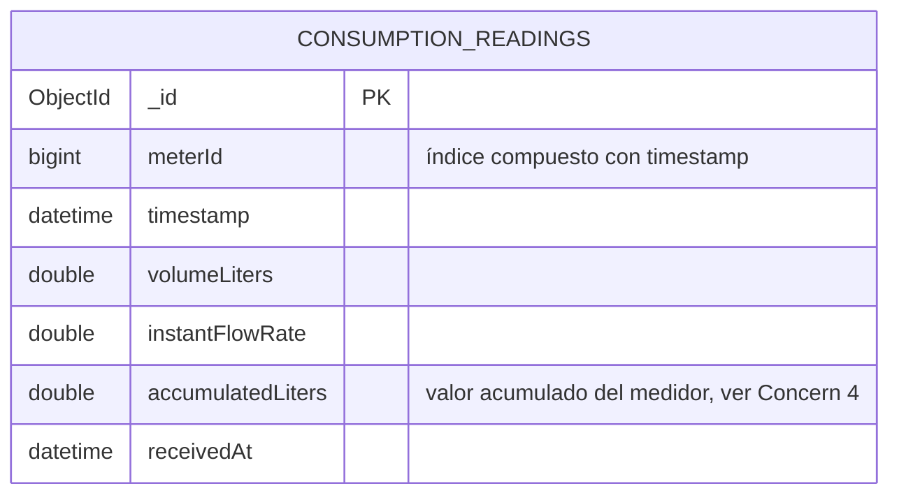
```mermaid
erDiagram
    CONSUMPTION_READINGS {
        ObjectId _id PK
        bigint meterId "índice compuesto con timestamp"
        datetime timestamp
        double volumeLiters
        double instantFlowRate
        double accumulatedLiters "valor acumulado del medidor, ver Concern 4"
        datetime receivedAt
    }
```

La colección `consumption_readings` no define un esquema fijo de columnas ni relaciones declarativas: cada documento es autocontenido y se indexa por el par (`meterId`, `timestamp`) para soportar eficientemente las consultas por rango de fechas que alimentan el historial y los reportes. La clave de idempotencia (`meterId` + `timestamp` del sensor) permite descartar reenvíos duplicados en la capa de aplicación (patrón Idempotent Consumer, sección 4.1.6), y el campo `accumulatedLiters` habilita recalcular el consumo del intervalo aun cuando se pierdan lecturas intermedias (Architectural Concern 4, sección 4.2.5).

**Microservicio: Alertas y Notificaciones**

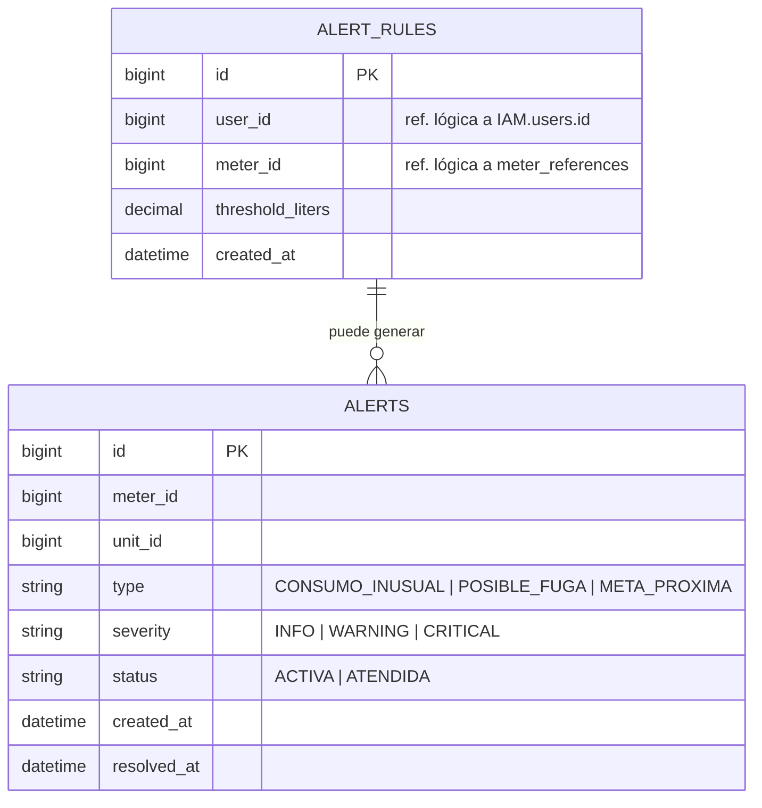
```mermaid
erDiagram
    ALERT_RULES ||--o{ ALERTS : "puede generar"

    ALERT_RULES {
        bigint id PK
        bigint user_id "ref. lógica a IAM.users.id"
        bigint meter_id "ref. lógica a meter_references"
        decimal threshold_liters
        datetime created_at
    }
    ALERTS {
        bigint id PK
        bigint meter_id
        bigint unit_id
        string type "CONSUMO_INUSUAL | POSIBLE_FUGA | META_PROXIMA"
        string severity "INFO | WARNING | CRITICAL"
        string status "ACTIVA | ATENDIDA"
        datetime created_at
        datetime resolved_at
    }
```

`alert_rules` almacena el umbral configurado por el usuario (US08), y `alerts` registra cada anomalía detectada por las estrategias del patrón Strategy (4.1.6), conservando el `meter_id` que originó la lectura. Cuando ese medidor es uno de zona (RIEGO, COCINA o BAÑO), la alerta indica esa zona como origen aproximado; cuando la lectura proviene del medidor `GENERAL` —el único obligatorio por unidad—, la alerta se registra como una fuga general de la unidad, sin precisión de ubicación dentro de la vivienda (US09).

**Microservicio: Ahorro y Recomendaciones**

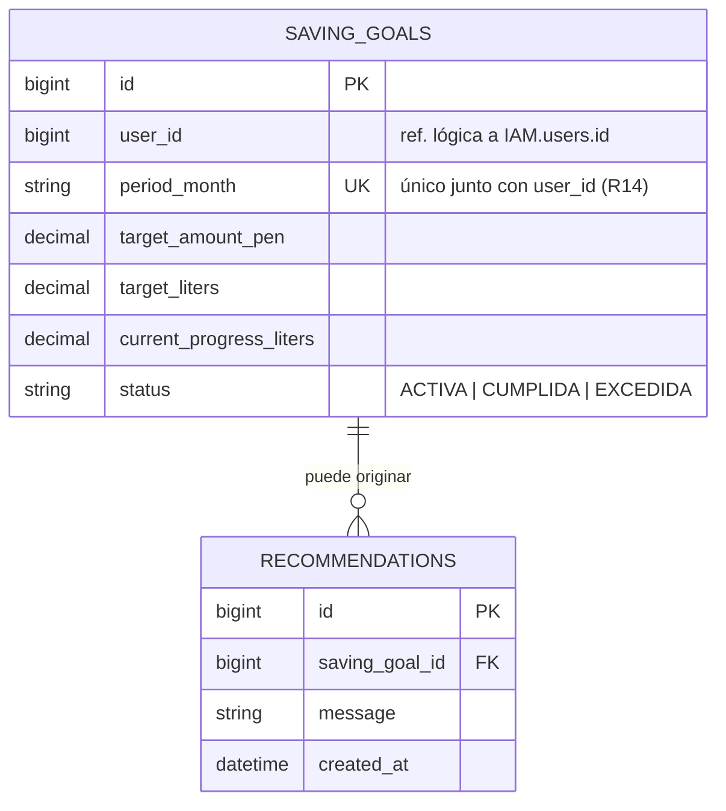
```mermaid
erDiagram
    SAVING_GOALS ||--o{ RECOMMENDATIONS : "puede originar"

    SAVING_GOALS {
        bigint id PK
        bigint user_id "ref. lógica a IAM.users.id"
        string period_month UK "único junto con user_id (R14)"
        decimal target_amount_pen
        decimal target_liters
        decimal current_progress_liters
        string status "ACTIVA | CUMPLIDA | EXCEDIDA"
    }
    RECOMMENDATIONS {
        bigint id PK
        bigint saving_goal_id FK
        string message
        datetime created_at
    }
```

El constraint de negocio "solo una meta activa por usuario y periodo" (R14) se implementa como una restricción de unicidad compuesta sobre (`user_id`, `period_month`), evitando a nivel de base de datos que se creen metas duplicadas para el mismo mes.

**Microservicio: Analíticas y Reportes**

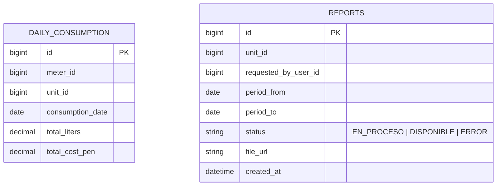
```mermaid
erDiagram
    DAILY_CONSUMPTION {
        bigint id PK
        bigint meter_id
        bigint unit_id
        date consumption_date
        decimal total_liters
        decimal total_cost_pen
    }
    REPORTS {
        bigint id PK
        bigint unit_id
        bigint requested_by_user_id
        date period_from
        date period_to
        string status "EN_PROCESO | DISPONIBLE | ERROR"
        string file_url
        datetime created_at
    }
```

`daily_consumption` es el modelo de lectura (read model) del patrón CQRS: se actualiza de forma asíncrona al consumir `ConsumptionRecorded` desde MongoDB/RabbitMQ y evita recalcular el historial a partir de las lecturas crudas en cada consulta al dashboard (Escenario 6, sección 4.2.3). `reports` referencia el archivo generado y almacenado en AWS S3 (R16), y sus filas no se modifican una vez marcadas como `DISPONIBLE`, preservando su validez como evidencia ante disputas (Architectural Concern 12).

**Microservicio: Suscripciones**

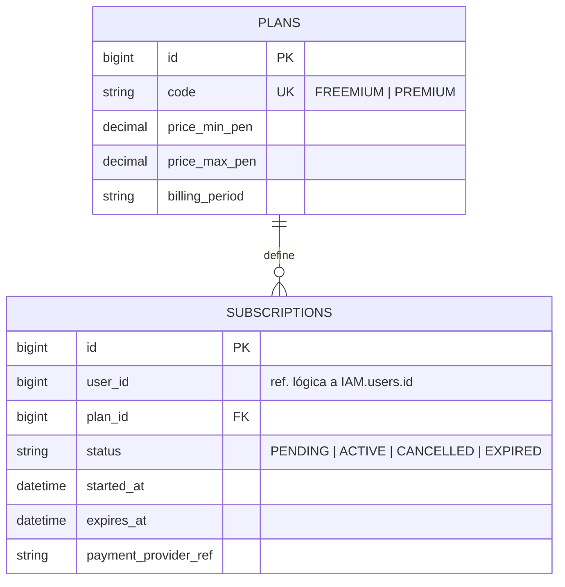
```mermaid
erDiagram
    PLANS ||--o{ SUBSCRIPTIONS : "define"

    PLANS {
        bigint id PK
        string code UK "FREEMIUM | PREMIUM"
        decimal price_min_pen
        decimal price_max_pen
        string billing_period
    }
    SUBSCRIPTIONS {
        bigint id PK
        bigint user_id "ref. lógica a IAM.users.id"
        bigint plan_id FK
        string status "PENDING | ACTIVE | CANCELLED | EXPIRED"
        datetime started_at
        datetime expires_at
        string payment_provider_ref
    }
```

`plans` refleja los planes y rangos de precio definidos en el constraint R13 (Freemium y Premium), y `subscriptions.payment_provider_ref` conserva únicamente la referencia de la transacción de Stripe/Culqi, sin persistir datos de tarjeta en la base de datos de HydroSmart (Escenario 8, sección 4.2.3).

### 4.1.6 Design Patterns

A continuación se detallan los patrones de diseño que se emplearán en la construcción de los microservicios de HydroSmart, organizados por su intención (creacionales, estructurales y de comportamiento) y vinculados al bounded context donde se aplican. Estos patrones instancian, a nivel de código, los estilos y principios ya definidos en la sección 4.1.2.

**1. Patrones Creacionales: Flexibilidad en la Construcción**

- **Factory Method:** empleado en el microservicio de Alertas y Notificaciones para instanciar la estrategia de detección correspondiente (umbral fijo, flujo continuo o desviación histórica) a partir del tipo de regla configurada, sin que el código cliente conozca la clase concreta de cada detector.
- **Builder:** utilizado en el microservicio de Analíticas y Reportes para construir el objeto `Report` (que combina periodo, agregados diarios, formato de salida y metadatos de auditoría) de forma incremental, evitando constructores con una cantidad excesiva de parámetros.

**2. Patrones Estructurales: Organización y Abstracción**

- **API Gateway:** centraliza el acceso al backend mediante un único punto de entrada que maneja autenticación, enrutamiento y validaciones básicas antes de llegar a los microservicios internos.
- **Facade Pattern (Anti-Corruption Layer):** aplicado en la comunicación entre bounded contexts; por ejemplo, el microservicio de Propiedades y Unidades expone una fachada simplificada para que Alertas y Notificaciones o Analíticas y Reportes verifiquen la existencia y el rol de un usuario sin acoplarse a la implementación interna de IAM (US11, US12).
- **Adapter Pattern:** traduce los formatos particulares de servicios externos (Firebase Authentication, Firebase Cloud Messaging, SendGrid, Stripe/Culqi, sensores IoT de distintos fabricantes) al modelo interno de HydroSmart, aislando el dominio de los contratos de terceros (Architectural Concern 2, sección 4.2.5).
- **Repository Pattern:** abstrae el acceso a los datos definidos en 4.1.5, permitiendo, por ejemplo, migrar la persistencia de lecturas hacia otra base optimizada para series de tiempo sin alterar la lógica de dominio de Consumo y Telemetría (Escenario 5 de mantenibilidad, sección 4.2.3).
- **Layered Architecture:** cada microservicio se organiza en capas de presentación (controladores REST), aplicación (casos de uso), dominio y persistencia, separando la lógica de negocio de los frameworks y proveedores externos (principio de la sección 4.1.1).

**3. Patrones de Comportamiento: Colaboración y Escalabilidad**

- **Observer Pattern (Eventos de Dominio):** cuando Consumo y Telemetría registra una lectura, publica `ConsumptionRecorded` para que Alertas y Notificaciones y Analíticas y Reportes reaccionen de forma desacoplada, sin conocerse entre sí.
- **Strategy Pattern:** encapsula los distintos algoritmos de detección de anomalías (umbral configurable, flujo continuo fuera de horario, desviación respecto a la línea base histórica) bajo una interfaz común en el microservicio de Alertas y Notificaciones (US09), facilitando incorporar nuevas reglas sin modificar las existentes.
- **CQRS (Command Query Responsibility Segregation):** separa los comandos que alteran el estado (`RegisterConsumptionCommand`, `CreateSavingGoalCommand`) de las consultas de solo lectura (`GetDashboardSummaryQuery`, `GetConsumptionHistoryQuery`), permitiendo que el volumen constante de escritura de lecturas no degrade las consultas masivas del historial (Escenario 6 y 7, sección 4.2.3).
- **Idempotent Consumer:** aplicado en Consumo y Telemetría para descartar lecturas duplicadas provenientes de reenvíos de red del sensor, usando la clave (`meterId`, `timestamp`) descrita en 4.1.5 (Architectural Concern 4).
- **Chain of Responsibility:** implementado en el envío de alertas críticas, encadenando el canal de notificación push (Firebase Cloud Messaging) con el canal alternativo de correo (SendGrid) como siguiente eslabón cuando el primero falla, sin que el emisor de la alerta conozca cuál de los dos canales finalmente la entregó (Escenario 11, sección 4.2.3).
- **Circuit Breaker:** protege las llamadas salientes hacia servicios externos no críticos (pasarela de pagos, almacenamiento de imágenes), evitando que una degradación de estos proveedores bloquee hilos o recursos del microservicio que los invoca, y permitiendo una respuesta rápida de "servicio no disponible" mientras el proveedor se recupera (Architectural Concern 10, sección 4.2.5).
- **Template Method:** define la estructura común del ciclo de vida de un reporte descargable en Analíticas y Reportes (validar periodo → consolidar agregados → generar archivo → publicar en S3 → notificar), dejando que cada formato de salida (PDF, CSV) implemente únicamente el paso de serialización.
- **RESTful API Design:** buenas prácticas de recursos, verbos HTTP y códigos de estado consistentes en todos los endpoints expuestos a través del API Gateway, documentados con OpenAPI 3.1 (R04).

### 4.1.7 Tactics

Siguiendo el catálogo de tácticas arquitectónicas del método ADD, se seleccionan tácticas concretas para cada atributo de calidad priorizado en los Quality Attribute Scenarios (sección 4.2.3) y en los constraints (sección 4.2.4), evitando dejar el atributo "tiempo real" como una noción genérica: cada táctica se ancla a una medida de respuesta numérica ya comprometida en un escenario específico.

**Disponibilidad**

- **Redundancia activa (Active Redundancy):** múltiples instancias del microservicio de Consumo y Telemetría procesan en paralelo; ante la caída de un nodo, el balanceador de carga redirige el tráfico a las instancias activas en menos de 5 segundos, sin pérdida de lecturas (Escenario 1, sección 4.2.3).
- **Heartbeat:** cada medidor debe emitir una señal periódica; su ausencia marca el medidor como OFFLINE en `meter_references` (4.1.5) en un máximo de 5 minutos (Escenario 2).
- **Colas durables con acknowledgement:** RabbitMQ retiene las lecturas en cola ante una falla transitoria del microservicio consumidor, garantizando disponibilidad del 99.9 % (Escenario 1) sin pérdida de mensajes.

**Rendimiento**

- **Introducir concurrencia y balanceo de carga:** consumidores competidores en RabbitMQ escalan horizontalmente según el tamaño de la cola, soportando hasta 20 000 lecturas por minuto con un retraso menor a 5 segundos (Escenario 5).
- **Mantener múltiples copias de datos (modelo de lectura CQRS):** los agregados diarios precalculados en `daily_consumption` (4.1.5) evitan recalcular el consumo desde las lecturas crudas, permitiendo que el dashboard cargue en menos de 2 segundos (Escenario 6) y la proyección mensual en menos de 3 segundos (Escenario 7).
- **Reducir la sobrecarga computacional (índices):** los índices compuestos (`meterId`, `timestamp`) en MongoDB y las claves de unicidad en MySQL descritos en 4.1.5 evitan escaneos completos al resolver las consultas de historial.
- **Comunicación asíncrona no bloqueante:** el envío de la notificación push tras `LeakDetected` se procesa fuera del hilo de ingesta, cumpliendo la entrega en menos de 15 segundos en el percentil 95 (Escenario 2 de la segunda tabla de QAS, sección 4.2.3).

**Escalabilidad**

- **Servicios sin estado (Stateless Services) con autoescalado horizontal:** los microservicios no retienen sesión localmente, permitiendo que la infraestructura escale de 500 a 5 000 sensores activos sin incrementar la latencia de procesamiento en más de un 20 % (Escenario 4 de la segunda tabla de QAS).
- **Particionamiento por bounded context:** cada microservicio escala de forma independiente según su propia demanda (por ejemplo, Consumo y Telemetría ante picos de ingesta, sin necesidad de escalar Suscripciones), evitando el acoplamiento de capacidad entre dominios distintos.

**Seguridad**

- **Autenticar actores:** validación criptográfica de la firma y expiración del JWT emitido por Firebase Authentication en el API Gateway, rechazando el 100 % de los tokens inválidos o expirados con estado 401 (Escenario 8).
- **Autorizar actores:** verificación de la relación de propiedad (`owner_id`) o de asignación (`unit_tenants`) antes de exponer datos de una unidad, rechazando con estado 403 el 100 % de los accesos no autorizados (Escenario 9).
- **Autenticación a nivel de dispositivo:** cada sensor se conecta mediante MQTT sobre TLS (R10) con credenciales únicas por medidor, restringiendo su publicación a su propio tópico y evitando la suplantación de sensores (Escenario 10).

**Privacidad**

- **Limitar el acceso por consentimiento y finalidad:** los datos de consumo de una unidad, que revelan hábitos y horarios del hogar, se exponen exclusivamente al propietario asociado, al inquilino asignado y al administrador autorizado, en cumplimiento de la Ley N.° 29733 (R11, Architectural Concern 8, sección 4.2.5).
- **Anonimización de datos en analíticas agregadas:** los agregados publicados en `daily_consumption` (4.1.5) no exponen el detalle de lecturas individuales fuera del contexto de la unidad correspondiente, limitando la superficie de exposición de patrones de comportamiento del hogar.

**Recuperabilidad / Resiliencia**

- **Checkpoint / rollback transaccional:** cada lectura se persiste de forma transaccional antes de publicar `ConsumptionRecorded`, de modo que un fallo durante el procesamiento no deja el sistema en un estado parcialmente consistente (principio de integridad de la sección 4.1.1).
- **Reintentos con espera exponencial y canal alternativo:** ante la falla del proveedor de notificaciones push, el sistema reintenta y conmuta al canal de correo (SendGrid), asegurando que el 99 % de las alertas críticas llegue por al menos un canal en menos de 5 minutos (Escenario 11).
- **Retención y respaldo de lecturas crudas:** la política de retención de MongoDB por plan de suscripción (Architectural Concern 9) se complementa con snapshots periódicos, permitiendo reconstruir los agregados de `daily_consumption` ante una pérdida parcial de los datos consolidados.

**Interoperabilidad**

- **Definiciones de interfaces compartidas:** los contratos de comunicación entre el API Gateway y los microservicios se documentan con OpenAPI 3.1 (R04), permitiendo que el frontend web (Angular) y móvil (Flutter) descubran y consuman los endpoints de forma autónoma.
- **Adaptadores por fabricante de sensor:** la integración de un nuevo modelo de medidor requiere únicamente un adaptador adicional en el gateway de ingesta, sin modificar el contrato canónico de lectura ni los microservicios de dominio (Escenario 14, sección 4.2.3).

**Mantenibilidad**

- **Encapsular mediante Repository Pattern:** el cambio de proveedor de persistencia de las lecturas de consumo se limita a la capa de repositorio, sin alterar la lógica de dominio ni los contratos de API, completándose en un máximo de tres días de trabajo (Escenario 5 de la segunda tabla de QAS).
- **Bounded Contexts con base de datos independiente:** un cambio en la gestión de propiedades no afecta la detección de fugas, ya que cada microservicio evoluciona y se despliega de forma aislada (Architectural Concern 13, sección 4.2.5).
 
El propósito del diseño arquitectónico de HydroSmart, producto de la startup AquaPulse, es construir una plataforma web y móvil que permita a los usuarios residenciales monitorear en tiempo real su consumo de agua, detectar fugas de manera temprana y traducir cada litro consumido en su equivalente económico, a partir de las lecturas enviadas por sensores IoT y medidores inteligentes de terceros. La arquitectura debe garantizar que cada decisión de diseño esté justificada por el valor que aporta a los segmentos objetivo del sistema: los propietarios de viviendas con áreas verdes y los estudiantes y jóvenes arrendatarios con presupuesto limitado.
 
**Coherencia con el Dominio del Negocio**
 
*   Implementar un sistema que refleje con precisión los procesos reales de gestión del agua en el hogar: registro de propiedades y unidades, vinculación de medidores, captura de lecturas, emisión de alertas y seguimiento de metas de ahorro.
*   Asegurar que las abstracciones arquitectónicas correspondan con los bounded contexts definidos mediante DDD: Gestión de Identidad (IAM), Propiedades y Unidades, Consumo y Telemetría, Alertas y Notificaciones, Ahorro y Recomendaciones, Analíticas y Reportes, y Suscripciones.
*   Mantener trazabilidad entre las épicas EP01 a EP09, las User Stories priorizadas en el Product Backlog y los microservicios que las implementan.
**Monitoreo en Tiempo Real como Eje del Diseño**
 
*   Diseñar el flujo de ingesta de lecturas (sensor IoT → gateway de ingesta MQTT → microservicio de Consumo y Telemetría) como el camino crítico del sistema, ya que la propuesta de valor depende de que el usuario conozca su consumo antes de recibir el recibo físico.
*   Priorizar la frescura de los datos mostrados en el dashboard, indicando siempre la fecha y hora de la última lectura recibida y el estado de conexión de cada medidor.
*   Garantizar que la plataforma funcione con sensores y medidores de distintos fabricantes, dado que AquaPulse no fabrica ni comercializa hardware propio.
**Detección Temprana y Alertas Oportunas**
 
*   Diseñar un mecanismo de evaluación continua de las lecturas que identifique consumos que superan el umbral configurado y patrones de flujo continuo fuera del horario habitual, característicos de una posible fuga.
*   Garantizar que las alertas lleguen al usuario en segundos mediante notificaciones push (Firebase Cloud Messaging), con un canal alternativo por correo electrónico si el canal principal falla.
*   Evitar la saturación de notificaciones agrupando alertas de una misma anomalía y respetando las preferencias configuradas por cada usuario.
**Traducción del Consumo a Impacto Económico**
 
*   Convertir el consumo registrado en litros y metros cúbicos a soles, aplicando la estructura tarifaria vigente de la empresa prestadora del servicio (por ejemplo, SEDAPAL en Lima) aprobada por SUNASS.
*   Proveer proyecciones del monto mensual del recibo y comparativos entre periodos que permitan al usuario anticiparse y ajustar sus hábitos de consumo.
*   Permitir que las metas de ahorro se definan a partir del presupuesto mensual del usuario, calculando automáticamente su equivalente en litros.
**Experiencia Simple y Mobile-First**
 
*   Diseñar la aplicación móvil como el canal principal de interacción, dado que los segmentos consultan su consumo y reciben alertas desde el celular.
*   Presentar los datos de consumo con etiquetas, colores e indicadores visuales comprensibles para usuarios sin conocimientos técnicos, tal como lo solicitaron los entrevistados.

**Seguridad, Privacidad y Control de Acceso por Roles**
 
*   Delegar la autenticación a Firebase Authentication y aplicar control de acceso basado en roles (Propietario, Inquilino y Administrador), diferenciando con claridad las capacidades de cada perfil en cada operación del sistema.
*   Restringir el acceso a los datos de consumo de cada unidad exclusivamente a su propietario, al inquilino asignado y al administrador autorizado, dado que los patrones de consumo revelan hábitos y horarios del hogar.
*   Cumplir con la Ley N.° 29733 de Protección de Datos Personales, informando al usuario cómo se almacenan y protegen sus datos y permitiéndole gestionarlos.
La arquitectura debe actuar como un puente coherente entre las necesidades reales de los hogares y las capacidades tecnológicas de la plataforma, asegurando que cada componente del sistema aporte valor directo al objetivo de negocio: transformar el consumo pasivo de agua en una gestión preventiva, inteligente y económica, que permita actuar antes de que el gasto se convierta en un problema.

El propósito principal del diseño de HydroSmart es construir una plataforma escalable, segura y de baja latencia capaz de transformar las lecturas continuas de sensores IoT en información accionable para distintos perfiles de usuario (propietarios de viviendas e inquilinos), permitiéndoles detectar fugas, optimizar el consumo de agua y proyectar su gasto de forma anticipada.

Desde la perspectiva de negocio, el sistema busca proveer una experiencia diferencial frente a soluciones tradicionales de medición: en lugar de entregar únicamente lecturas de volumen, HydroSmart interpreta esos datos mediante algoritmos de detección de anomalías y proyecciones financieras, agregando valor directo al usuario final. El modelo de monetización basado en suscripciones escalonadas (Freemium, Pro, Smart) refuerza la necesidad de garantizar alta disponibilidad y confiabilidad, ya que una interrupción en el servicio afecta directamente la percepción de valor del producto.

Desde la perspectiva técnica, el diseño arquitectónico está orientado a satisfacer tres objetivos fundamentales:

1. **Procesamiento continuo y en tiempo real:** Las lecturas de caudal generadas por los sensores IoT deben ser ingestadas, validadas, procesadas y reflejadas en el dashboard del usuario con la menor latencia posible, garantizando que las alertas de fuga lleguen de forma oportuna.
2. **Escalabilidad progresiva y mantenibilidad:** La arquitectura de microservicios organizada en Bounded Contexts (IAM, Consumo y Telemetría, Alertas y Notificaciones, Analíticas y Reportes, Suscripciones, entre otros) permite que cada dominio escale y evolucione de forma independiente, sin comprometer la integridad del sistema completo.
3. **Seguridad y trazabilidad de los datos:** Los datos de consumo hídrico constituyen el activo más crítico del sistema. La plataforma garantiza su integridad mediante procesamiento idempotente (para evitar lecturas duplicadas), validación por rol de usuario en cada petición y delegación de la gestión de identidad a Firebase Authentication.

En síntesis, el diseño de HydroSmart no busca únicamente conectar sensores a una interfaz visual, sino construir un ecosistema de datos hídricos que sea confiable, seguro y capaz de crecer junto con la base de usuarios sin sacrificar la experiencia ni la precisión de la información entregada.

### 4.2.2 Primary Functionality (Primary User Stories)
 
Las siguientes User Stories representan la funcionalidad primaria que define la estructura arquitectónica central del sistema. Se agrupan por área funcional y se detalla el impacto arquitectónico que cada una genera.
 
#### Funcionalidad Core - Registro y autenticación
 
**US01: Registro de usuario**
 
Como usuario nuevo, quiero registrarme indicando mi tipo de perfil para acceder a las funcionalidades adaptadas a mis necesidades de consumo de agua.
 
**Impacto Arquitectónico:** Establece el microservicio IAM con integración a Firebase Authentication, delegando completamente la gestión de credenciales al proveedor externo; la entidad `users` almacena únicamente el `firebase_uid` como referencia, sin persistir contraseñas localmente. Define la relación uno a uno entre `users` y `profiles`, y la asignación del tipo de perfil mediante la tabla intermedia `user_roles` (PROPIETARIO, INQUILINO, ADMINISTRADOR) en un modelo muchos a muchos. Al completarse el registro, IAM publica el evento de dominio `UserRegistered` para que los demás bounded contexts inicialicen la información del usuario sin acoplarse a IAM.
 
**US02: Inicio de sesión**
 
Como usuario registrado, quiero iniciar sesión de forma segura para acceder a mi información de consumo sin riesgo a que otros accedan a mis datos.
 
**Impacto Arquitectónico:** Define que el inicio de sesión se realiza contra Firebase Authentication, que emite un token JWT (TS02) con el identificador del usuario. La validación de la firma y expiración del token se centraliza en el API Gateway, de modo que los microservicios internos reciben únicamente peticiones autenticadas y aplican el control de acceso según el rol registrado en IAM.
 
#### Funcionalidad Core - Monitoreo de Consumo
 
**US04: Visualización de consumo en tiempo real**
 
Como usuario, quiero visualizar mi consumo de agua en tiempo real para reducir la incertidumbre sobre mi gasto y poder tomar decisiones inmediatas.
 
**Impacto Arquitectónico:** Define la operación más crítica del sistema y el microservicio de Consumo y Telemetría. Los sensores IoT publican sus lecturas mediante MQTT hacia el gateway de ingesta, que las traduce y reenvía al microservicio, donde se almacenan en la entidad `consumption_readings`, vinculada a `meters` mediante `meter_id`. Cada unidad cuenta obligatoriamente con un `Meter` de zona `GENERAL` (el único que alimenta el cálculo tarifario oficial) y, de forma opcional, con medidores IoT adicionales que el propio usuario instala si desea un desglose por zona (RIEGO, COCINA, BAÑO); el consumo "por zona" que se muestra en el dashboard solo está disponible para las zonas que cuentan con un medidor físico instalado, ya que el medidor general no puede atribuir el caudal a un punto específico de la vivienda. Cada `Meter` registra su zona y su estado de conexión (ONLINE, OFFLINE) según la fecha de su última lectura, lo que permite mostrar el mensaje de datos no disponibles cuando el medidor pierde conexión (escenario 2 de US04). El consumo se expresa en litros y en soles aplicando la entidad `tariffs` sobre la lectura del medidor `GENERAL`, y cada lectura persistida publica el evento `ConsumptionRecorded`.
 
**US07: Proyección de gasto mensual**
 
Como usuario, quiero ver una proyección de mi gasto mensual para anticiparme al monto del recibo y planificar mejor mi presupuesto.
 
**Impacto Arquitectónico:** Requiere que el microservicio de Analíticas y Reportes consuma el evento `ConsumptionRecorded` y mantenga agregados precalculados en la entidad `daily_consumption`, a partir de los cuales se calcula la proyección del mes. La conversión a soles aplica la estructura tarifaria por rangos de consumo definida en `tariffs` y `tariff_ranges`, parametrizada por empresa prestadora y categoría. La regla de negocio que exige al menos una semana de datos para proyectar se implementa como validación del dominio.
 
#### Funcionalidad Core - Alertas y Notificaciones
 
**US08: Alerta de consumo inusual**
 
Como usuario, quiero recibir alertas cuando mi consumo sea inusual para poder actuar a tiempo y evitar gastos excesivos.
 
**Impacto Arquitectónico:** Define el microservicio de Alertas y Notificaciones, que se suscribe al evento `ConsumptionRecorded` mediante el patrón Observer (publicación/suscripción sobre RabbitMQ), manteniendo desacoplados ambos bounded contexts. La entidad `alert_rules` almacena el umbral configurado por el usuario y la entidad `alerts` registra cada anomalía con su tipo (CONSUMO_INUSUAL, POSIBLE_FUGA, META_PROXIMA), severidad y estado (ACTIVA, ATENDIDA). El envío de la notificación push se delega a Firebase Cloud Messaging.
 
**US09: Alerta de posible fuga**
 
Como propietario, quiero recibir una alerta cuando el sistema detecte una posible fuga para tomar acción antes de que el desperdicio sea irreversible.
 
**Impacto Arquitectónico:** Requiere el patrón Strategy en el microservicio de Alertas y Notificaciones para encapsular los distintos algoritmos de detección (umbral fijo, flujo continuo fuera del horario habitual, desviación respecto al promedio histórico) bajo una interfaz común, facilitando la incorporación de nuevas reglas sin alterar la lógica existente. Al confirmarse la anomalía se publica el evento `LeakDetected`: si el flujo continuo fue detectado por un medidor de zona (RIEGO, COCINA o BAÑO) instalado por el usuario, la alerta indica esa zona como origen aproximado; pero si la unidad solo cuenta con el medidor `GENERAL`, el sistema no puede atribuir la fuga a un punto específico y la alerta se reporta como "posible fuga detectada en el domicilio", sin inferir su ubicación exacta dentro de la vivienda.
 

#### Funcionalidad Core - Ahorro y Metas
 
**US14: Establecer meta de ahorro**
 
Como inquilino, quiero establecer una meta de consumo mensual para controlar mi gasto y evitar exceder mi presupuesto.
 
**Impacto Arquitectónico:** Define el microservicio de Ahorro y Recomendaciones con la entidad `SavingGoal`, que almacena el presupuesto mensual en soles, su equivalente en litros calculado con la tarifa vigente, el periodo y el estado (ACTIVA, CUMPLIDA, EXCEDIDA). La invariante de negocio establece una sola meta activa por usuario y periodo. El microservicio consume el evento `ConsumptionRecorded` para actualizar el avance y, al alcanzar el 80 % de la meta, publica el evento `GoalThresholdReached`, que Alertas y Notificaciones convierte en notificación.
 
#### Funcionalidad Core - Historial y Reportes
 
**US06: Historial de consumo**
 
Como usuario, quiero revisar mi historial de consumo para identificar patrones y entender cómo varía mi gasto en el tiempo.
 
**Impacto Arquitectónico:** Establece la aplicación del patrón CQRS en el microservicio de Analíticas y Reportes: las consultas de historial (por ejemplo, `GetConsumptionHistoryQuery`) se resuelven sobre agregados diarios, semanales y mensuales, separadas de la escritura continua de lecturas en Consumo y Telemetría. Esto permite responder rápidamente a los gráficos del historial sin afectar el procesamiento en tiempo real.
 

Las siguientes User Stories representan la funcionalidad primaria que define la estructura arquitectónica central del sistema. Se agrupan por área funcional y se detalla el impacto arquitectónico que cada una genera.

**Funcionalidad Core – Registro y Autenticación**

US-06: Registro e inicio de sesión seguro

Como usuario, quiero registrarme e iniciar sesión de forma segura con mi correo electrónico para acceder únicamente a los datos de mis viviendas o unidades.

Impacto Arquitectónico: Establece el microservicio de Gestión de Identidad (IAM) con integración a Firebase Authentication, delegando completamente la gestión de credenciales al proveedor externo. La entidad User almacena únicamente el firebase_uid como referencia, sin persistir contraseñas localmente. Define la relación uno a uno entre User y Profile, y la asignación de roles mediante la enumeración UserType (OWNER, TENANT, ADMIN). Esta separación establece la validación de acceso en el API Gateway, donde cada petición es verificada contra el token JWT y el rol del usuario antes de ser enrutada al microservicio correspondiente.

**Funcionalidad Core – Monitoreo y Telemetría en Tiempo Real**

US-01: Monitoreo de consumo en tiempo real

Como propietario, quiero visualizar en mi dashboard el caudal de agua de mi vivienda en tiempo real para identificar variaciones inusuales de inmediato.

Impacto Arquitectónico: Establece el pipeline de ingesta IoT como el componente más crítico del sistema. Los sensores/medidores inteligentes envían lecturas de caudal mediante un protocolo ligero (MQTT) hacia el gateway de ingesta, el cual traduce y reenvía la información al microservicio de Consumo y Telemetría a través de eventos internos. La entidad ConsumptionRecord registra cada lectura con volumeLiters, instantFlowRate y timestamp. Se aplica el patrón Idempotent Consumer para evitar que reenvíos del sensor (por fallas de red) dupliquen una lectura y distorsionen el consumo real. El evento de dominio `ConsumptionRecorded` se publica al Message Broker (RabbitMQ) para ser consumido de forma asíncrona por los bounded contexts de Alertas y Analíticas.

US-02: Detección y alerta de fugas

Como propietario, quiero recibir una notificación push inmediata cuando el sistema detecte un patrón de consumo continuo o anómalo que indique una posible fuga.

Impacto Arquitectónico: Define el bounded context de Alertas y Notificaciones como consumidor del evento `ConsumptionRecorded`. El módulo AnomalyDetector evalúa cada lectura contra los umbrales configurados (sensitivityThreshold) y contra patrones de consumo continuo fuera de lo habitual. Si detecta una anomalía, genera el evento `LeakDetected` y solicita al servicio externo de notificaciones push (Firebase Cloud Messaging) que envíe una alerta inmediata al dispositivo del usuario, indicando la severidad (INFO, WARNING, CRITICAL) y, únicamente cuando la lectura anómala proviene de un medidor de zona adicional instalado por el usuario, la zona aproximada donde se originó; de lo contrario, la alerta se reporta de forma general para todo el domicilio, ya que un único medidor `GENERAL` no permite inferir en qué punto de la vivienda ocurre la fuga. La latencia entre la recepción de la lectura anómala y la entrega de la notificación push no debe superar los 15 segundos en el percentil 95.

**Funcionalidad Core – Analíticas y Proyecciones**

US-03: Proyección de gasto mensual

Como usuario, quiero ver una proyección del gasto en agua de mi vivienda para el cierre del mes en curso, basada en mi consumo histórico y en tiempo real.

Impacto Arquitectónico: Requiere el bounded context de Analíticas y Reportes con acceso a series temporales de consumo. El servicio CostCalculator aplica el tarifario vigente de SEDAPAL (pricePerCubicMeter, fixedCharge, taxRate) para transformar el volumen consumido en un costo proyectado en soles. Se implementa el patrón CQRS para separar las consultas de proyección (GetDashboardSummaryQuery) de las operaciones de escritura de nuevas lecturas (RegisterConsumptionCommand), optimizando las consultas masivas del historial y el dashboard sin afectar la ingesta continua de datos.

US-07: Historial de consumo y reportes exportables

Como propietario, quiero consultar el historial de consumo de mis unidades por rango de fechas y exportarlo en formato PDF o CSV para presentarlo ante la junta de propietarios o ante mi inquilino.

Impacto Arquitectónico: Establece que el microservicio de Analíticas y Reportes debe exponer endpoints de consulta y exportación que lean los datos consolidados de las series temporales de consumo y los transformen en los formatos requeridos (PDF, CSV). El acceso a estos reportes queda restringido exclusivamente a usuarios con el rol verificado de propietario de la unidad consultada, aplicando validación de rol en cada petición.

**Funcionalidad Core – Ahorro y Recomendaciones**

US-04: Gestión de metas de ahorro

Como usuario, quiero establecer una meta de consumo mensual en m³ o en soles para recibir recomendaciones y alertas cuando me acerque al límite.

Impacto Arquitectónico: Introduce la lógica de dominio del bounded context de Ahorro y Recomendaciones. La entidad SavingGoal persiste los objetivos del usuario (targetVolume, targetCost, startDate, endDate, currentProgress) y el sistema verifica periódicamente el avance respecto a la meta. La entidad Recommendation genera sugerencias automáticas para optimizar el consumo basándose en el comportamiento histórico. Cuando el consumo acumulado supera un umbral porcentual de la meta, se dispara una alerta preventiva a través del bounded context de Alertas y Notificaciones.

**Funcionalidad Core – Monetización y Suscripciones**

US-08: Gestión de suscripción y pagos

Como usuario, quiero contratar o cambiar mi plan de suscripción (Freemium, Pro, Smart) y realizar el pago de forma segura para desbloquear las funcionalidades correspondientes a mi nivel.

Impacto Arquitectónico: Define el bounded context de Suscripciones, que gestiona el ciclo de vida completo de la suscripción del usuario: plan_type (Freemium, Pro, Smart), estado activo/inactivo y fecha de renovación. Se integra con una pasarela de pagos externa (Stripe o Culqi) mediante el Adapter Pattern para procesar las transacciones de forma segura. El estado de la suscripción debe sincronizarse con las capacidades de cada plan, controlando qué funcionalidades (alertas avanzadas, reportes exportables, metas personalizadas) están disponibles para cada nivel.

### 4.2.3 Quality Attribute Scenarios
 
En esta sección se definen los Escenarios de Atributos de Calidad (QAS) para la arquitectura de la plataforma HydroSmart. Estos escenarios constituyen una herramienta fundamental de diseño y validación, ya que permiten operativizar y hacer completamente medibles los requerimientos no funcionales del sistema, tales como el rendimiento, la disponibilidad, la seguridad, la escalabilidad y la usabilidad. Al desglosar cada situación en componentes específicos (fuente, estímulo, entorno, artefacto, respuesta y medida de la respuesta), se establecen criterios de prueba claros y verificables. De esta manera, se asegura que las decisiones arquitectónicas implementadas soporten las exigencias operativas del monitoreo del consumo de agua y estén directamente alineadas con el cumplimiento de las User Stories críticas del proyecto.
 
**Escenario 1: Disponibilidad - Falla de un nodo de Consumo y Telemetría**
 
| Elemento | Descripción |
|---|---|
| **Fuente del estímulo** | Infraestructura de red o fallo de hardware interno. |
| **Estímulo** | Un nodo que aloja una instancia del microservicio de Consumo y Telemetría deja de responder repentinamente mientras se reciben lecturas de los sensores. |
| **Entorno** | Tiempo de ejecución, bajo operación normal con usuarios consultando su dashboard. |
| **Artefacto** | Infraestructura de servidores y microservicio de Consumo y Telemetría. |
| **Respuesta** | El sistema emplea Redundancia Activa: el balanceador de carga detecta la falla mediante health checks y redirige las peticiones hacia las instancias activas, mientras las lecturas pendientes permanecen en las colas durables de RabbitMQ hasta ser consumidas por otra instancia. |
| **Medida de la respuesta** | La conmutación hacia las instancias de respaldo se realiza en menos de 5 segundos, sin pérdida de lecturas, garantizando una disponibilidad del 99.9 % del servicio de monitoreo. |
 
**Escenario 2: Disponibilidad - Pérdida de conexión de un medidor**
 
| Elemento | Descripción |
|---|---|
| **Fuente del estímulo** | Sensor IoT o medidor inteligente de terceros. |
| **Estímulo** | El medidor de una vivienda deja de enviar lecturas por un corte de energía o pérdida de conectividad WiFi. |
| **Entorno** | Tiempo de ejecución, operación normal. |
| **Artefacto** | Microservicio de Consumo y Telemetría (entidad `meters`) y dashboard del usuario. |
| **Respuesta** | El sistema aplica la táctica Heartbeat: cada medidor debe reportar al menos una señal periódica; si no se recibe, el medidor pasa al estado OFFLINE, el dashboard muestra el mensaje de datos no disponibles junto con la última lectura válida y se notifica al usuario. |
| **Medida de la respuesta** | La desconexión se detecta y se refleja en el dashboard en un máximo de 5 minutos desde la última señal recibida, en el 100 % de los casos. |
 
**Escenario 3: Rendimiento - Alerta de consumo inusual**
 
| Elemento | Descripción |
|---|---|
| **Fuente del estímulo** | Sensor IoT del usuario. |
| **Estímulo** | Llega una lectura cuyo consumo supera el umbral configurado por el usuario. |
| **Entorno** | Tiempo de ejecución, carga normal de lecturas. |
| **Artefacto** | Microservicio de Alertas y Notificaciones y servicio externo Firebase Cloud Messaging. |
| **Respuesta** | El sistema procesa el evento `ConsumptionRecorded` de forma asíncrona, evalúa las reglas del usuario, registra la alerta y envía la notificación push con el detalle de la anomalía. |
| **Medida de la respuesta** | La notificación push llega al dispositivo del usuario en menos de 10 segundos desde la recepción de la lectura en el 95 % de los casos. |
 
**Escenario 4: Rendimiento / Fiabilidad - Detección de posible fuga**
 
| Elemento | Descripción |
|---|---|
| **Fuente del estímulo** | Sensor IoT del usuario. |
| **Estímulo** | Se registra un flujo de agua continuo durante un periodo prolongado fuera del horario habitual del hogar (por ejemplo, un inodoro malogrado durante la madrugada). |
| **Entorno** | Tiempo de ejecución, horario nocturno con bajo consumo esperado. |
| **Artefacto** | Microservicio de Alertas y Notificaciones (estrategia de detección de fugas). |
| **Respuesta** | El sistema compara el patrón de consumo con la línea base histórica del usuario por franja horaria y, al confirmar el flujo continuo durante el periodo configurado (30 minutos por defecto), publica el evento `LeakDetected` y genera una alerta de tipo POSIBLE_FUGA. Si la anomalía se detectó en un medidor de zona adicional (RIEGO, COCINA o BAÑO), la alerta indica esa zona como origen aproximado; si la unidad solo cuenta con el medidor `GENERAL`, la alerta se reporta como fuga general del domicilio, sin precisión de ubicación. |
| **Medida de la respuesta** | La alerta se emite en menos de 1 minuto después de cumplido el periodo configurado, con una tasa de falsos positivos menor al 5 % en las pruebas de validación. |
 
**Escenario 5: Escalabilidad - Ingesta masiva de lecturas**
 
| Elemento | Descripción |
|---|---|
| **Fuente del estímulo** | Sensores IoT de múltiples usuarios. |
| **Estímulo** | Al crecer la base de usuarios hacia la meta de 800 usuarios activos, miles de sensores envían lecturas de forma simultánea cada 15 segundos. |
| **Entorno** | Tiempo de ejecución, pico de tráfico de lecturas en horas de mayor consumo (mañana, noche y horarios de riego). |
| **Artefacto** | Gateway de ingesta, RabbitMQ y microservicio de Consumo y Telemetría. |
| **Respuesta** | El sistema utiliza Comunicación Asíncrona mediante colas de mensajes: las lecturas se encolan en RabbitMQ y son procesadas por consumidores competidores que escalan horizontalmente según el tamaño de la cola. |
| **Medida de la respuesta** | El sistema soporta la ingesta de hasta 20,000 lecturas por minuto sin pérdida de mensajes y con un retraso de procesamiento menor a 5 segundos. |
 
**Escenario 6: Rendimiento - Carga del dashboard de consumo**
 
| Elemento | Descripción |
|---|---|
| **Fuente del estímulo** | Usuario (propietario o inquilino). |
| **Estímulo** | El usuario abre la aplicación móvil para revisar su consumo del día en litros y soles. |
| **Entorno** | Tiempo de ejecución, bajo condiciones normales de operación. |
| **Artefacto** | Aplicación móvil y microservicios de Consumo y Telemetría y Analíticas y Reportes. |
| **Respuesta** | El sistema emplea la táctica de Mantener múltiples copias de datos: la última lectura de cada medidor y los agregados del día se mantienen precalculados (modelo de lectura CQRS), evitando recalcular el consumo a partir de las lecturas crudas en cada consulta. |
| **Medida de la respuesta** | El dashboard se carga con el consumo actual, su equivalente en soles y el avance de la meta en menos de 2 segundos. |
 
**Escenario 7: Rendimiento - Cálculo de la proyección mensual**
 
| Elemento | Descripción |
|---|---|
| **Fuente del estímulo** | Usuario. |
| **Estímulo** | El usuario solicita la proyección estimada del monto a pagar al cierre del mes. |
| **Entorno** | Tiempo de ejecución, usuario con al menos una semana de consumo registrado. |
| **Artefacto** | Microservicio de Analíticas y Reportes (entidad `daily_consumption`) y tarifas de Consumo y Telemetría. |
| **Respuesta** | El sistema calcula la proyección a partir de los agregados diarios ya consolidados y aplica la estructura tarifaria por rangos vigente, sin procesar el historial completo de lecturas. |
| **Medida de la respuesta** | La proyección en soles se muestra en menos de 3 segundos, con una desviación menor al 10 % respecto al recibo real al cierre del periodo. |
 
**Escenario 8: Seguridad - Acceso con token expirado**
 
| Elemento | Descripción |
|---|---|
| **Fuente del estímulo** | Consumidor del API (usuario, sistema externo o atacante). |
| **Estímulo** | Se realiza una petición hacia un endpoint protegido (por ejemplo, consulta del consumo de una unidad) utilizando un token JWT caducado o alterado. |
| **Entorno** | Tiempo de ejecución, intento de consumo del servicio. |
| **Artefacto** | API Gateway y microservicio IAM. |
| **Respuesta** | El sistema aplica las tácticas de Autenticar actores y Limitar el acceso, validando criptográficamente la firma y la fecha de expiración del JWT emitido por Firebase Authentication en el API Gateway. La petición es rechazada antes de llegar a los microservicios internos. |
| **Medida de la respuesta** | El sistema otorga 0 % de acceso a las funcionalidades protegidas cuando el token es inválido o ha expirado, respondiendo con estado 401. |
 
**Escenario 9: Seguridad / Privacidad - Acceso a datos de otra unidad**
 
| Elemento | Descripción |
|---|---|
| **Fuente del estímulo** | Usuario autenticado (propietario o inquilino). |
| **Estímulo** | Un usuario intenta consultar el consumo o los reportes de una unidad que no le pertenece o a la que no está asignado, modificando el identificador en la petición. |
| **Entorno** | Tiempo de ejecución, operación normal. |
| **Artefacto** | Microservicios de Propiedades y Unidades, Consumo y Telemetría, y Analíticas y Reportes. |
| **Respuesta** | El sistema aplica la táctica de Autorizar actores, verificando en cada operación la relación de propiedad (`owner_id`) o de asignación (`unit_tenants`) entre el usuario y la unidad, y registra el intento en el log de auditoría. |
| **Medida de la respuesta** | El 100 % de los intentos de acceso a unidades ajenas es rechazado con estado 403 y queda registrado, sin exponer datos de consumo de terceros. |
 
**Escenario 10: Seguridad - Suplantación de un sensor**
 
| Elemento | Descripción |
|---|---|
| **Fuente del estímulo** | Agente externo no autorizado. |
| **Estímulo** | Un dispositivo no registrado intenta publicar lecturas falsas en el tópico MQTT de un medidor existente. |
| **Entorno** | Tiempo de ejecución, ingesta de lecturas. |
| **Artefacto** | Gateway de ingesta MQTT y microservicio de Consumo y Telemetría. |
| **Respuesta** | El sistema aplica la táctica de Autenticar actores a nivel de dispositivo: cada sensor se conecta mediante MQTT sobre TLS con credenciales únicas emitidas al vincularlo, y el gateway solo le permite publicar en su propio tópico. |
| **Medida de la respuesta** | El 100 % de las conexiones con credenciales inválidas es rechazado y ninguna lectura falsa llega a ser registrada en `consumption_readings`. |
 
**Escenario 11: Disponibilidad - Falla del proveedor de notificaciones push**
 
| Elemento | Descripción |
|---|---|
| **Fuente del estímulo** | Servicio externo Firebase Cloud Messaging. |
| **Estímulo** | El proveedor de notificaciones push no responde o devuelve error al enviar una alerta de posible fuga. |
| **Entorno** | Tiempo de ejecución, envío de alertas críticas. |
| **Artefacto** | Microservicio de Alertas y Notificaciones. |
| **Respuesta** | El sistema aplica reintentos con espera exponencial y, si el envío continúa fallando, utiliza el canal alternativo de correo electrónico mediante SendGrid, manteniendo la alerta visible en la aplicación. |
| **Medida de la respuesta** | El 99 % de las alertas críticas llega al usuario por al menos un canal en menos de 5 minutos, aun con el proveedor push no disponible. |
 
**Escenario 12: Usabilidad - Configuración de una meta de ahorro**
 
| Elemento | Descripción |
|---|---|
| **Fuente del estímulo** | Inquilino (estudiante o joven arrendatario). |
| **Estímulo** | El usuario desea establecer su meta de consumo mensual ingresando únicamente su presupuesto disponible en soles. |
| **Entorno** | Tiempo de ejecución, primer uso de la sección de metas. |
| **Artefacto** | Aplicación móvil y microservicio de Ahorro y Recomendaciones. |
| **Respuesta** | El sistema calcula automáticamente la meta equivalente en litros con la tarifa vigente y muestra el resultado con indicadores visuales, sin que el usuario necesite conocer conceptos técnicos como metros cúbicos o rangos tarifarios. |
| **Medida de la respuesta** | El 90 % de los usuarios de prueba configura su meta en menos de 1 minuto y en no más de 3 pasos, sin solicitar ayuda. |
 
**Escenario 13: Modificabilidad - Actualización de tarifas de agua**
 
| Elemento | Descripción |
|---|---|
| **Fuente del estímulo** | Administrador de la plataforma. |
| **Estímulo** | SUNASS aprueba un reajuste tarifario para SEDAPAL o se incorpora una nueva empresa prestadora en otra región del país. |
| **Entorno** | Tiempo de ejecución, operación normal. |
| **Artefacto** | Microservicio de Consumo y Telemetría (entidades `tariffs` y `tariff_ranges`). |
| **Respuesta** | Las tarifas se gestionan como datos parametrizados y versionados por fecha de vigencia, no como lógica codificada, de modo que el administrador registra la nueva estructura sin modificar ni volver a desplegar los microservicios. |
| **Medida de la respuesta** | La nueva tarifa se aplica a los cálculos en soles en menos de 1 día hábil, con 0 líneas de código modificadas. |
 
**Escenario 14: Interoperabilidad - Integración de un nuevo modelo de sensor**
 
| Elemento | Descripción |
|---|---|
| **Fuente del estímulo** | Equipo de desarrollo. |
| **Estímulo** | Se requiere dar soporte a un nuevo fabricante de medidores inteligentes cuyo formato de lectura es distinto al de los medidores ya integrados. |
| **Entorno** | Tiempo de diseño y desarrollo. |
| **Artefacto** | Gateway de ingesta y microservicio de Consumo y Telemetría. |
| **Respuesta** | El sistema aplica el patrón Adapter y la táctica de Definiciones de interfaces compartidas: cada fabricante cuenta con un adaptador que traduce su formato al contrato canónico de lectura (`meterId`, `timestamp`, litros acumulados), sin modificar la lógica de dominio. |
| **Medida de la respuesta** | La integración del nuevo fabricante se completa en un máximo de 3 días de desarrollo, modificando únicamente el nuevo adaptador. |
 

En esta sección se definen los Escenarios de Atributos de Calidad (QAS) para la arquitectura de la plataforma HydroSmart. Estos escenarios constituyen una herramienta fundamental de diseño y validación, ya que permiten operativizar y hacer completamente medibles los requerimientos no funcionales (RNF) del sistema, tales como el rendimiento, la seguridad, la disponibilidad y la escalabilidad. Al desglosar cada atributo en términos de fuente, estímulo, artefacto, entorno, respuesta y medida, se garantiza que cada decisión arquitectónica pueda ser verificada objetivamente.

Escenario 1: Disponibilidad – Ingesta continua de lecturas IoT

| Elemento | Descripción |
| :--- | :--- |
| **Fuente del estímulo** | Sensor IoT instalado en el punto de suministro de agua de una vivienda. |
| **Estímulo** | El sensor envía lecturas de caudal de forma continua cada 30 segundos durante las 24 horas del día. |
| **Entorno** | Tiempo de ejecución, bajo condiciones de operación normal en producción con múltiples sensores activos simultáneamente. |
| **Artefacto** | Microservicio de Consumo y Telemetría + Message Broker (RabbitMQ). |
| **Respuesta** | El sistema procesa e ingesta cada lectura sin pérdida de datos. Ante una falla del microservicio, el Message Broker retiene los eventos en cola y el servicio los procesa al recuperarse. |
| **Medida de la respuesta** | El servicio debe estar disponible el **99.5 %** del tiempo mensual, garantizando cero pérdida de lecturas incluso ante reinicios o fallas transitorias del nodo. |

Escenario 2: Rendimiento – Notificación de fuga en tiempo real

| Elemento | Descripción |
| :--- | :--- |
| **Fuente del estímulo** | Módulo AnomalyDetector del bounded context de Alertas y Notificaciones. |
| **Estímulo** | El algoritmo detecta un patrón de consumo continuo indicativo de fuga (flujo constante durante más de 60 minutos sin interrupción). |
| **Entorno** | Operación normal en producción; el usuario tiene la app instalada con permisos de notificaciones push activos. |
| **Artefacto** | Bounded context de Alertas y Notificaciones + Firebase Cloud Messaging. |
| **Respuesta** | El sistema genera el evento `LeakDetected`, persiste la alerta con severidad CRITICAL y despacha la notificación push al dispositivo del usuario. |
| **Medida de la respuesta** | El tiempo transcurrido desde la recepción de la lectura anómala hasta la entrega de la notificación push no debe superar los **15 segundos** en el percentil 95 de las solicitudes. |

Escenario 3: Seguridad – Acceso no autorizado a datos de consumo

| Elemento | Descripción |
| :--- | :--- |
| **Fuente del estímulo** | Usuario no autenticado o con rol incorrecto (por ejemplo, un inquilino intentando acceder a datos de una unidad que no le pertenece). |
| **Estímulo** | Intento de acceso a los endpoints de consumo, alertas o reportes de una unidad sin autorización. |
| **Entorno** | Cualquier entorno (producción o staging), bajo condiciones normales de operación. |
| **Artefacto** | API Gateway + microservicio de Gestión de Identidad (IAM). |
| **Respuesta** | El sistema valida el token JWT y el rol del usuario; si la validación falla, rechaza la solicitud con un error `403 Forbidden` sin exponer información sensible ni datos de la unidad consultada. |
| **Medida de la respuesta** | El **100 %** de los endpoints protegidos valida token y rol antes de procesar la petición. Ningún dato de consumo es accesible sin autorización explícita del propietario correspondiente. |

Escenario 4: Escalabilidad – Crecimiento de sensores activos

| Elemento | Descripción |
| :--- | :--- |
| **Fuente del estímulo** | Crecimiento orgánico de la base de usuarios y sensores registrados en la plataforma. |
| **Estímulo** | El número de sensores activos se incrementa de 500 a 5 000 en un periodo de seis meses. |
| **Entorno** | Crecimiento sostenido en producción, con picos de lecturas simultáneas en horas punta de consumo (mañana y noche). |
| **Artefacto** | Microservicio de Consumo y Telemetría + Message Broker (RabbitMQ). |
| **Respuesta** | El sistema mantiene el procesamiento de lecturas dentro de los umbrales de latencia definidos, escalando horizontalmente las instancias del microservicio sin cambios en la arquitectura ni en los contratos de API. |
| **Medida de la respuesta** | La latencia de procesamiento de una lectura no debe incrementarse más del **20 %** respecto a la línea base cuando la carga de sensores se multiplica por 10. |

Escenario 5: Mantenibilidad – Cambio de proveedor de persistencia

| Elemento | Descripción |
| :--- | :--- |
| **Fuente del estímulo** | Equipo de desarrollo durante una fase de evolución del sistema. |
| **Estímulo** | Se requiere migrar el almacenamiento de lecturas de consumo a una base de datos optimizada para series de tiempo (por ejemplo, InfluxDB o TimescaleDB). |
| **Entorno** | Fase de evolución del sistema (iteración futura), sin afectar la operación en producción. |
| **Artefacto** | Capa de repositorio (Repository Pattern) del microservicio de Consumo y Telemetría. |
| **Respuesta** | El cambio de proveedor de persistencia se realiza modificando únicamente la implementación del repositorio, sin alterar la lógica de dominio, los eventos publicados ni los contratos de API. |
| **Medida de la respuesta** | La migración no requiere modificaciones en ningún otro bounded context ni en el API Gateway. El tiempo de implementación y pruebas no debe superar **tres días** de trabajo del equipo. |

Escenario 6: Interoperabilidad – Integración de nuevo protocolo IoT

| Elemento | Descripción |
| :--- | :--- |
| **Fuente del estímulo** | Fabricante de sensor IoT externo que utiliza un protocolo de comunicación diferente al inicialmente soportado (por ejemplo, CoAP en lugar de MQTT). |
| **Estímulo** | Se integra un nuevo modelo de medidor inteligente con un formato de telemetría distinto. |
| **Entorno** | Expansión del ecosistema de hardware compatible de HydroSmart. |
| **Artefacto** | Gateway de ingesta IoT (Adapter Pattern). |
| **Respuesta** | El sistema incorpora el nuevo protocolo implementando un adaptador en el gateway de ingesta, traduciendo el formato del sensor al modelo interno de ConsumptionRecord sin modificar el microservicio de Consumo y Telemetría ni los bounded contexts internos. |
| **Medida de la respuesta** | La integración de un nuevo protocolo de sensor requiere únicamente la creación del adaptador correspondiente, con **cero cambios** en los microservicios de dominio internos. |

Escenario 7: Rendimiento – Carga del dashboard de consumo

| Elemento | Descripción |
| :--- | :--- |
| **Fuente del estímulo** | Usuario propietario accediendo al dashboard principal de la aplicación. |
| **Estímulo** | El usuario solicita la visualización del resumen de consumo actual, la proyección de gasto mensual y el estado de sus metas de ahorro. |
| **Entorno** | Operación normal en producción, con múltiples usuarios consultando el dashboard simultáneamente. |
| **Artefacto** | Bounded context de Analíticas y Reportes + API Gateway. |
| **Respuesta** | El sistema recupera y presenta los datos consolidados del dashboard (consumo actual, proyección, metas) de forma completa y sin errores. |
| **Medida de la respuesta** | El tiempo de carga del dashboard completo no debe superar los **2 segundos** en el percentil 95, incluyendo el consumo en tiempo real, la proyección y el progreso de ahorro. |

Escenario 8: Seguridad – Procesamiento de pagos de suscripción

| Elemento | Descripción |
| :--- | :--- |
| **Fuente del estímulo** | Usuario que contrata o cambia su plan de suscripción (Freemium, Pro, Smart). |
| **Estímulo** | El usuario inicia el flujo de pago para activar o actualizar su suscripción. |
| **Entorno** | Operación normal en producción, con datos financieros sensibles en tránsito. |
| **Artefacto** | Bounded context de Suscripciones + pasarela de pagos externa (Stripe/Culqi). |
| **Respuesta** | El sistema delega el procesamiento del pago a la pasarela externa mediante HTTPS, sin almacenar datos de tarjeta localmente. El estado de la suscripción se actualiza únicamente tras confirmación exitosa de la pasarela. |
| **Medida de la respuesta** | El **100 %** de las transacciones de pago se procesan a través de la pasarela certificada PCI-DSS. Ningún dato financiero del usuario se persiste en la base de datos de HydroSmart. |

### 4.2.4 Constraints
 
Identificamos los factores técnicos, legales o de diseño que limitan y condicionan el desarrollo del proyecto. Estas condiciones establecen el marco obligatorio dentro del cual se debe construir la solución, asegurando su viabilidad dentro del entorno previsto.
 
| ID | Descripción |
|---|---|
| R01 | La autenticación debe delegarse a Firebase Authentication, y el sistema debe validar los permisos mediante tokens JWT y roles de usuario (Propietario, Inquilino y Administrador) para bloquear accesos no autorizados a funcionalidades y datos de consumo. |
| R02 | AquaPulse no fabrica ni comercializa hardware: la captura de datos depende de sensores IoT y medidores inteligentes de terceros compatibles que publiquen sus lecturas mediante el protocolo MQTT. Cada vivienda o unidad requiere, como mínimo, un medidor `GENERAL` en el punto de suministro; el desglose de consumo por zona (riego, cocina, baño) es una funcionalidad opcional que depende de que el usuario instale medidores IoT adicionales en cada zona, dado que un único medidor general no puede atribuir el caudal registrado a un punto específico de la vivienda. |
| R03 | La plataforma y los servicios web deben seguir el enfoque de diseño DDD (Domain-Driven Design), con una arquitectura de microservicios en la que cada bounded context gestiona su propia base de datos. |
| R04 | El backend debe exponer una API RESTful en formato JSON, documentada con OpenAPI 3.1 / Swagger, a través de un único API Gateway para su consumo desde la aplicación web y la aplicación móvil. |
| R05 | Los servicios backend deben permitir exponer APIs REST seguras, documentadas, escalables horizontalmente y mantenibles por bounded context. La tecnología específica del backend será seleccionada mediante análisis ADD. |
| R06 | La aplicación web y la aplicación móvil deben permitir una experiencia responsive, segura y mantenible, con capacidad de consumir APIs REST protegidas. Los frameworks concretos serán seleccionados mediante análisis ADD. |
| R07 | La landing page debe desarrollarse con HTML, CSS y JavaScript, y ser responsive para dispositivos móviles. |
| R08 | La plataforma debe separar la persistencia transaccional de la persistencia de telemetría. La base transaccional debe soportar relaciones entre usuarios, propiedades, unidades, medidores, planes y notificaciones; mientras que la base de telemetría debe soportar almacenamiento eficiente de lecturas de consumo como series de tiempo. |
| R09 | Las lecturas de los sensores deben recibirse mediante MQTT a través de un gateway de ingesta, y la comunicación asíncrona entre microservicios debe realizarse mediante RabbitMQ. |
| R10 | El intercambio de datos entre clientes y servidor debe realizarse mediante HTTPS, y la conexión de los sensores mediante MQTT sobre TLS. |
| R11 | El tratamiento de los datos personales y de consumo debe cumplir con la Ley N.° 29733, Ley de Protección de Datos Personales, y su reglamento. |
| R12 | Los montos deben expresarse en soles (PEN) y calcularse según la estructura tarifaria de la empresa prestadora del servicio (SEDAPAL en Lima) aprobada por SUNASS. |
| R13 | La plataforma contará con dos planes de suscripción: Freemium y Premium (S/ 15 a S/ 25 mensuales), cuyos pagos se procesan mediante una pasarela externa (Stripe o Culqi). |
| R14 | Solo puede existir una meta de ahorro activa por usuario y periodo mensual, y un medidor solo puede estar vinculado a una unidad a la vez. |
| R15 | Las notificaciones push deben enviarse mediante Firebase Cloud Messaging y los correos electrónicos mediante SendGrid. |
| R16 | Las imágenes de perfil y los reportes descargables deben almacenarse en AWS S3, y la solución debe desplegarse en la nube de AWS. |
| R17 | La aplicación web debe ser compatible con las dos últimas versiones de Chrome, Firefox, Safari y Edge, y la aplicación móvil con Android 8.0 e iOS 14 o superiores. |
| R18 | La solución debe completarse dentro del periodo académico 2026-20, según el cronograma de entregas del curso. |

### 4.2.5 Architectural Concerns
 
**1. Ingesta Confiable de Lecturas en Tiempo Real**
 
Recibir de forma continua las lecturas de miles de sensores sin perder información es la base de todo el sistema. Se aborda mediante un **gateway de ingesta MQTT** que reenvía las lecturas a **RabbitMQ** con colas durables y confirmación de mensajes (acknowledgement), de modo que una lectura solo se descarta de la cola cuando el microservicio de **Consumo y Telemetría** la ha registrado correctamente.
 
**2. Heterogeneidad de los Sensores de Terceros**
 
Al no contar con hardware propio, HydroSmart debe convivir con sensores y medidores de distintos fabricantes y formatos. Se resuelve con el patrón **Adapter** como capa anticorrupción en el gateway de ingesta, traduciendo cada formato a un contrato canónico de lectura (meterId, timestamp, litros acumulados).
 
**3. Precisión y Granularidad en la Detección y Localización de Fugas**
 
Una alerta falsa reduce la confianza del usuario, y una fuga no detectada anula la propuesta de valor. Se aborda con el patrón **Strategy** en el microservicio de **Alertas y Notificaciones**, combinando umbrales configurables con una línea base histórica del consumo de cada hogar por franja horaria. Es importante precisar que la **granularidad de la localización** de una fuga depende directamente del número de medidores físicos instalados: con el único medidor `GENERAL` obligatorio por unidad, el sistema solo puede confirmar que existe un flujo anómalo en la vivienda, sin poder atribuirlo a una zona o ambiente específico; la localización aproximada por zona (riego, cocina, baño) requiere que el usuario haya instalado medidores IoT adicionales en esos puntos (R02).
 
**4. Lecturas Perdidas, Duplicadas o Fuera de Orden**
 
Los cortes de conexión pueden provocar reenvíos o vacíos en los datos. Se aplica el patrón **Idempotent Consumer**, registrando cada lectura con la clave única (meterId, timestamp), y se trabaja con el valor **acumulado** del medidor, lo que permite recalcular el consumo del intervalo aunque se pierdan lecturas intermedias.
 
**5. Conversión Confiable del Consumo a Soles**
 
El valor económico mostrado debe coincidir con lo que el usuario pagará. Las tarifas se modelan como datos **parametrizados y versionados** por empresa prestadora, categoría, rango de consumo y fecha de vigencia, y los montos se presentan siempre como estimaciones referenciales del recibo.
 
**6. Entrega Garantizada y No Invasiva de Alertas**
 
Las alertas deben llegar a tiempo sin saturar al usuario. Se utilizan reintentos con espera exponencial, un canal alternativo por correo mediante **SendGrid** cuando **Firebase Cloud Messaging** falla, y la agrupación de alertas de una misma anomalía respetando las preferencias configuradas por el usuario (US10).
 
**7. Seguridad Perimetral y Validación de Identidad**
 
La protección contra accesos no autorizados se resuelve centralizando la validación de los **JWT de Firebase Authentication** en el **API Gateway**, que actúa como filtro de seguridad antes de que la petición llegue a los microservicios internos.
 
**8. Privacidad de los Datos de Consumo entre Usuarios**
 
Los patrones de consumo revelan hábitos y horarios de ocupación del hogar. Arquitectónicamente, se debe asegurar que cada usuario solo acceda al consumo de sus propias unidades y que el tratamiento de los datos cumpla la **Ley N.° 29733**, con consentimiento informado y opciones de gestión de datos (US17).
 
**9. Almacenamiento y Consulta Eficiente de Series de Tiempo**
 
El volumen de lecturas crece de forma constante. Se almacenan las lecturas crudas en **MongoDB** como series de tiempo y se consolidan agregados diarios, semanales y mensuales en **Analíticas y Reportes** (modelo de lectura **CQRS**) para el historial, la proyección y los reportes, aplicando una política de retención de lecturas crudas según el plan del usuario.
 
**10. Disponibilidad del Monitoreo ante Fallas de Servicios Secundarios**
 
El usuario debe seguir viendo su consumo y recibiendo alertas aunque servicios no críticos, como **Analíticas y Reportes** o **Ahorro y Recomendaciones**, estén caídos. Se utiliza **RabbitMQ** para desacoplar los servicios mediante comunicación asíncrona basada en eventos de dominio.
 
**11. Gestión de Planes de Suscripción (Monetización)**
 
Controlar que cada usuario acceda solo a las funcionalidades de su plan: por ejemplo, las alertas avanzadas y los reportes exportables son exclusivos del plan Premium. Esta preocupación es atendida por el microservicio de **Suscripciones**, que procesa los pagos mediante la pasarela externa (**Stripe o Culqi**) y sincroniza el estado del plan con las capacidades habilitadas en **Ahorro y Recomendaciones**.
 
**12. Trazabilidad y Evidencia del Consumo**
 
Los reportes por unidad sirven como evidencia ante disputas con inquilinos. Las lecturas se registran como datos **inmutables** (solo inserción) con marca de tiempo del medidor y del servidor, y cada reporte generado en **Analíticas y Reportes** conserva el periodo y la fuente de datos utilizada.
 
**13. Mantenibilidad mediante Bounded Contexts**
 
Evitar que un cambio en la gestión de propiedades afecte la detección de fugas. Siguiendo el enfoque **DDD**, cada microservicio tiene su propio contexto delimitado y base de datos independiente, y se comunica con los demás mediante contratos de API o eventos de dominio, facilitando actualizaciones aisladas.

## 4.3 ADD Iterations

### 4.3.1 Iteration 1: Establecimiento de la Base Arquitectónica y Pipeline de Telemetría (Sprint 1)

#### 4.3.1.1 Architectural Design Backlog 1

Para esta primera iteración, se consolidan los requerimientos funcionales, atributos de calidad, restricciones y objetivos de negocio más críticos que guiarán las decisiones iniciales de diseño arquitectónico de HydroSmart. En esta fase temprana del desarrollo, el foco principal es validar la viabilidad técnica del núcleo de la propuesta de valor: la ingesta continua y de baja latencia de telemetría IoT desde medidores inteligentes de caudal, la detección oportuna de fugas en tiempo real y el control de acceso seguro y aislado por unidad habitacional.

Por ello, este backlog aísla y prioriza exclusivamente aquellos drivers arquitectónicos que resultan indispensables para desplegar una primera versión operativa, robusta y escalable del sistema. A continuación, se detallan los elementos seleccionados para este primer sprint y la justificación estratégica detrás de su prioridad:

| Tipo de Driver | Driver Seleccionado | Razón |
|---|---|---|
| **Objetivo de Negocio** | Validar la propuesta de valor de HydroSmart (Misión de AquaPulse) | El núcleo del producto —permitir a los hogares monitorear su consumo hídrico en tiempo real y mitigar el desperdicio económico por fugas no detectadas— debe operar de manera confiable y validarse técnicamente desde la primera iteración. |
| **Requisito Funcional** | US-01 & US04: Monitoreo y visualización de consumo de caudal en tiempo real | Es la interacción primaria y el valor fundamental que percibe el usuario al consultar el estado de consumo de su vivienda o unidad desde el dashboard web y móvil. |
| **Requisito Funcional** | US-02 & US09: Detección temprana y alerta inmediata de posibles fugas de agua | Representa la funcionalidad protectora más crítica de la plataforma; si una fuga no se detecta oportunamente, la propuesta de valor de ahorro y prevención se anula. |
| **Requisito Funcional** | US-06 & US01: Registro e inicio de sesión seguro con Firebase Authentication y roles (Propietario, Inquilino, Administrador) | Es el mecanismo habilitador de seguridad transversal; garantiza que cada usuario acceda exclusivamente a los datos de sus propias unidades. |
| **Requisito Funcional** | US11: Registro de propiedades, unidades y vinculación 1:1 activa de medidores físicos (R14) | Modela la jerarquía esencial del dominio (`Usuario -> Propiedad -> Unidad -> Medidor`), sin la cual es imposible asociar una lectura de telemetría a un usuario responsable. |
| **Atributo de Calidad** | Performance y Latencia (QAS 4 / Escenario 4 & QAS 3): Detección y notificación push de fugas en menos de 15 segundos ($p95$) | La detección oportuna de anomalías requiere un flujo no bloqueante desde el sensor hasta el dispositivo móvil del usuario para evitar daños irreversibles o sobrecostos en el recibo. |
| **Atributo de Calidad** | Performance y Escalabilidad (QAS 5 / Escenario 5): Ingesta continua de hasta 20 000 lecturas/min sin degradación | La plataforma debe dimensionarse para absorber un flujo continuo de telemetría sin cuellos de botella en la persistencia ni en el procesamiento. |
| **Atributo de Calidad** | Seguridad y Privacidad (QAS 9 / Escenario 9 & R11): Aislamiento de datos de consumo y validación estricta de token JWT y roles (código 403 ante acceso no autorizado) | Cumplir con la Ley N.° 29733 de Protección de Datos Personales, impidiendo que terceros o inquilinos ajenos visualicen patrones de consumo y horarios de ocupación del hogar. |
| **Atributo de Calidad** | Disponibilidad y Resiliencia (QAS 1 / Escenario 1 & QAS 2): Redundancia activa y colas durables en RabbitMQ ante caídas, con detección de medidores desconectados (Heartbeat < 5 min) | El flujo de datos hídricos no puede perderse por fallas temporales de red o de instancias de cómputo. |
| **Restricción** | R01, R03 & R08: Autenticación delegada a Firebase Auth, arquitectura microservicios bajo DDD con bases independientes, y persistencia políglota (MySQL + MongoDB) | Define el estándar arquitectónico del sistema, evitando acoplamientos monolíticos y degradación de base de datos transaccional por lecturas de sensores. |
| **Restricción** | R04, R09 & R10: API RESTful JSON con OpenAPI 3.1 vía API Gateway, ingesta IoT vía MQTT sobre TLS y mensajería interna con RabbitMQ | Estandariza los protocolos de comunicación interna y externa bajo canales seguros y contratos explícitos. |
| **Preocupación Arquitectural** | Concern 1 & Concern 4: Ingesta confiable de telemetría en tiempo real y procesamiento idempotente (`meterId` + `timestamp`) | Asegura que ante caídas o reenvíos de paquetes de red de los medidores, las lecturas no se dupliquen ni alteren el cálculo del consumo acumulado. |
| **Preocupación Arquitectural** | Concern 2: Heterogeneidad de sensores de terceros mediante Adapter Pattern en el Gateway IoT | Permite convivir con diversos fabricantes de hardware sin alterar los contratos canónicos de los microservicios. |

#### 4.3.1.2 Establish Iteration Goal by Selecting Drivers

Para este primer ciclo de desarrollo arquitectónico, el equipo técnico se enfoca en consolidar los pilares que dan vida a la propuesta de valor de HydroSmart. Por ello, se han priorizado los siguientes drivers arquitectónicos:

- **Funcionalidad Core:** Habilitar el flujo crítico de la plataforma: registro y autenticación de usuarios, registro de propiedades y unidades habitacionales, vinculación 1:1 activa de medidores de caudal, ingesta continua de lecturas y detección y notificación inmediata de patrones de fuga en tiempo real.
- **Performance y Escalabilidad:** Garantizar una latencia de extremo a extremo inferior a 15 segundos ($p95$) entre la recepción de una lectura anómala por el broker MQTT y la entrega de la notificación push en el dispositivo del usuario, soportando además una tasa de ingesta de hasta 20 000 lecturas por minuto en MongoDB Time Series sin degradación de la base transaccional.
- **Seguridad, Privacidad y Accesos:** Implementar un esquema de autenticación sin estado (*stateless*) mediante tokens JWT emitidos por Firebase Authentication y validación estricta de roles (RBAC) en el API Gateway, asegurando un aislamiento total (100% de rechazos con código HTTP 403) ante cualquier intento de acceso no autorizado a datos de consumo de unidades ajenas, en cumplimiento de la Ley N.° 29733.
- **Alineamiento Tecnológico y Restricciones:** Sentar las bases del código bajo un enfoque Domain-Driven Design (DDD) y arquitectura de microservicios con bases de datos desacopladas, utilizando .NET REST API para los servicios backend, persistencia políglota (MySQL para datos transaccionales estructurados y MongoDB para telemetría de series de tiempo), y mensajería orientada a eventos mediante RabbitMQ.

**Objetivo de la Iteración:**  
El objetivo principal de esta primera iteración es diseñar, estructurar y validar la base arquitectónica fundamental de HydroSmart. Al lograr que el pipeline de telemetría IoT capture lecturas de caudal de forma continua e idempotente, que el motor de anomalías detecte posibles fugas con baja latencia y que el control de accesos proteja la información del hogar sobre una arquitectura de microservicios desacoplada y escalable, se comprueba la viabilidad tecnológica del producto y se entrega el primer incremento de valor real y medible para los stakeholders de AquaPulse.

#### 4.3.1.3 Choose One or More Elements of the System to Refine

A fin de satisfacer los drivers arquitectónicos definidos previamente y garantizar la entrega temprana de valor a los stakeholders del proyecto, se han identificado los elementos y bounded contexts críticos que requieren ser diseñados y refinados durante esta primera iteración:

1. **Microservicio de Consumo y Telemetría (Consumption & Telemetry Service):**
   - Se encarga de procesar el flujo continuo de lecturas crudas de caudal transmitidas por los sensores y medidores inteligentes de terceros a través del gateway de ingesta MQTT.
   - Aplica el patrón *Idempotent Consumer* utilizando la clave natural (`meterId`, `timestamp`) y el valor de litros acumulados (`accumulatedLiters`) para descartar lecturas duplicadas y tolerar paquetes fuera de orden.
   - Persiste la telemetría en MongoDB Time Series y publica el evento de dominio `ConsumptionRecorded` a través de RabbitMQ, permitiendo que otros bounded contexts reaccionen sin bloquear el camino crítico de ingesta.
   - Mantiene una réplica local de solo lectura (`meter_references`) para resolver la unidad, propiedad y usuario propietario asociados a cada medidor sin incurrir en llamadas síncronas entre microservicios.

2. **Microservicio de Alertas y Notificaciones (Alerts & Notifications Service):**
   - Consume de forma asíncrona los eventos `ConsumptionRecorded` desde RabbitMQ y evalúa las lecturas en tiempo real frente a umbrales configurados y patrones de consumo continuo no habituales (patrón Strategy).
   - Genera el evento `LeakDetected` al confirmar un patrón anómalo y orquesta el envío de notificaciones push de alta prioridad hacia el dispositivo móvil del usuario mediante Firebase Cloud Messaging (FCM).
   - Constituye el componente reactivo más valorado por los usuarios para prevenir daños estructurales y sobrecostos por desperdicio hídrico.

3. **Microservicio de Gestión de Identidad (IAM) y API Gateway:**
   - Centraliza la autenticación delegando la verificación de credenciales a Firebase Authentication y conservando únicamente el identificador único `firebase_uid`.
   - Administra la asignación de perfiles y roles del sistema (`PROPIETARIO`, `INQUILINO`, `ADMINISTRADOR`) mediante la tabla intermedia `user_roles`.
   - El API Gateway actúa como único punto de entrada (*Reverse Proxy*), validando la firma y vigencia del token JWT y verificando los permisos de rol antes de enrutar las peticiones hacia los microservicios internos.

4. **Microservicio de Propiedades y Unidades (Properties & Units Service):**
   - Modela y administra la jerarquía de dominio `Usuario -> Propiedad -> Unidad -> Medidor`, permitiendo a los propietarios registrar sus viviendas y estructurar sus unidades habitacionales.
   - Implementa el constraint de unicidad activa R14 mediante la entidad `unit_meter_links`, asegurando que un medidor físico solo pueda estar vinculado a una unidad a la vez (`unlinked_at IS NULL`).
   - Publica los eventos de dominio `MeterLinkedToUnit` y `MeterUnlinked`, alimentando de forma eventual la réplica `meter_references` del microservicio de Consumo y Telemetría.

La implementación conjunta de estos cuatro componentes y del API Gateway conforma el núcleo estructural del sistema. Al habilitar la trazabilidad completa desde el medidor hasta el usuario propietario y permitir la detección inmediata de fugas bajo un esquema seguro y escalable, se valida de inmediato la factibilidad arquitectónica de HydroSmart.

#### 4.3.1.4 Choose One or More Design Concepts That Satisfy the Selected Drivers

Para dar respuesta a los drivers arquitectónicos priorizados en esta iteración y establecer una base técnica robusta para HydroSmart, se han seleccionado los siguientes conceptos, tecnologías y patrones de diseño que guiarán la construcción de los elementos refinados:

**Performance y Escalabilidad:**
- **Persistencia Políglota y Separación de Cargas:** Se desacopla completamente el almacenamiento de telemetría de alto volumen (MongoDB Time Series, optimizado para inserción continua y consultas por rango de tiempo) de la base de datos transaccional (MySQL), garantizando que picos de hasta 20 000 lecturas/min no degraden los tiempos de respuesta del dashboard ni de las operaciones CRUD de usuarios y propiedades.
- **Comunicación Asíncrona Orientada a Eventos:** La ingesta de datos hídricos mediante MQTT y el desacoplamiento entre microservicios vía colas de RabbitMQ evitan cuellos de botella por llamadas HTTP síncronas en el camino crítico, permitiendo despachar alertas de fuga en menos de 15 segundos ($p95$).
- **Agregaciones Precalculadas (CQRS):** Las consultas de consumo histórico en el dashboard no recalculan millones de lecturas crudas en tiempo de ejecución, sino que leen datos agregados consolidados de forma asíncrona en `daily_consumption`.

**Security y Privacidad:**
- **Autenticación Delegada y Tokens JWT (Stateless):** Se delega la gestión de credenciales a Firebase Authentication (R01), eliminando el almacenamiento local de contraseñas. El API Gateway valida el token JWT en cada solicitud entrante, protegiendo todos los endpoints privados del backend.
- **Control de Acceso Basado en Roles (RBAC) y Aislamiento por Unidad:** Se aplican interceptores y políticas de autorización en el API Gateway y controladores backend para verificar que el usuario autenticado sea efectivamente el propietario o el inquilino asignado a la unidad consultada, bloqueando con código 403 el 100% de intentos de acceso indebido (R11, Ley N.° 29733).
- **Cifrado en Tránsito:** Todo el tráfico entre clientes web/móviles y el API Gateway se cifra mediante HTTPS (TLS 1.3), y la conexión de los sensores y medidores IoT hacia el gateway de ingesta se realiza bajo MQTT sobre TLS (R10).

**Interoperabilidad, Modificabilidad y DDD:**
- **Arquitectura de Microservicios orientada al Dominio (DDD):** El sistema se estructura en Bounded Contexts independientes con bases de datos propias (R03), implementando Arquitectura en Capas (Presentación, Aplicación, Dominio e Infraestructura) y el patrón Repository, desacoplando las reglas de negocio de los frameworks y proveedores de infraestructura.
- **Contratos de API Estandarizados (OpenAPI 3.1):** Los microservicios backend exponen interfaces RESTful en formato JSON documentadas exhaustivamente mediante Swagger / OpenAPI 3.1 (R04), garantizando contratos explícitos que facilitan el consumo desacoplado desde la Web App (Angular) y la Mobile App (Flutter).
- **Capa Anticorrupción y Patrón Adapter:** Las integraciones con servicios externos (Firebase Auth, Firebase Cloud Messaging, Stripe/Culqi, AWS S3 y medidores IoT heterogéneos) se encapsulan mediante adaptadores dedicados, impidiendo que cambios en contratos de terceros contaminen el modelo de dominio interno.

**Alta Disponibilidad y Resiliencia:**
- **Colas Durables y Confirmación de Mensajes (ACK):** En RabbitMQ las lecturas y alertas se configuran en colas persistentes; si un consumidor falla, los mensajes permanecen retenidos hasta que otra instancia disponible los procese (Redundancia Activa, Escenario 1).
- **Mecanismo de Heartbeat:** Los medidores reportan periódicamente su estado de conexión; ante la ausencia de lecturas durante más de 5 minutos, el medidor se cataloga como OFFLINE en `meter_references`, notificando al usuario en el dashboard (Escenario 2).

**Análisis ADD para la selección de tecnologías**

Antes de definir tecnologías específicas, se realiza un análisis de alternativas siguiendo el enfoque ADD. La selección se basa en los atributos de calidad definidos previamente. De esta manera, las herramientas elegidas no se consideran restricciones arbitrarias, sino decisiones arquitectónicas justificadas por los drivers del sistema.

**Decisión 1: Tecnología para servicios backend**

| Alternativa | Ventajas | Desventajas | Evaluación frente a QAS |
|---|---|---|---|
| **.NET REST API** | Buen soporte para APIs REST, seguridad, documentación con Swagger, arquitectura por capas, integración con bases SQL y despliegue cloud. | Requiere organizar correctamente los bounded contexts para evitar un backend monolítico. | Alta compatibilidad con seguridad, mantenibilidad y escalabilidad. |
| **Java 17 + Spring Boot** | Ecosistema maduro para microservicios, seguridad, mensajería y despliegue empresarial. | Implica mayor complejidad si el avance del proyecto ya se encuentra orientado a otro stack. | Buena alternativa, pero menos alineada con los elementos ya instanciados en el proyecto. |
| **Node.js + Express/NestJS** | Ligero y rápido para construir APIs. | Puede crecer de forma desordenada si no se define una arquitectura estricta; menor robustez transaccional si se implementa sin disciplina. | Útil para prototipos, pero menos conveniente para una solución dividida por bounded contexts. |

**Decisión seleccionada:** Se selecciona **.NET REST API** para los servicios backend, debido a que permite construir APIs REST seguras, documentadas y mantenibles. Además, facilita la organización por capas y módulos funcionales, alineándose con los bounded contexts definidos para HydroSmart. Esta decisión apoya los atributos de mantenibilidad, seguridad y escalabilidad.

**Decisión 2: Base de datos transaccional**

| Alternativa | Ventajas | Desventajas | Evaluación frente a QAS |
|---|---|---|---|
| **MySQL** | Adecuado para datos relacionales, ampliamente soportado, buen rendimiento para operaciones CRUD y facilidad de integración con .NET. | No es ideal para almacenar grandes volúmenes de telemetría continua. | Buena opción para usuarios, perfiles, dispositivos, planes, metas y notificaciones. |
| **PostgreSQL** | Mayor riqueza funcional, buen soporte para consultas complejas y extensiones. | Puede ser más complejo de administrar para el alcance del proyecto. | También viable, pero MySQL cubre suficientemente las necesidades transaccionales del sistema. |
| **MongoDB** | Flexible para documentos y datos semiestructurados. | No es la mejor opción para relaciones estrictas como usuario, propiedad, unidad y medidor. | No se selecciona como base transaccional principal por el peso de las relaciones del dominio. |

**Decisión seleccionada:** Se selecciona **MySQL** como base de datos transaccional, porque el dominio requiere relaciones claras entre usuarios, propiedades, unidades, medidores, planes, metas, alertas y notificaciones. Esta decisión responde a los atributos de consistencia, mantenibilidad y privacidad, ya que facilita controlar qué usuario puede acceder a qué datos.

**Decisión 3: Base de datos para telemetría de consumo**

| Alternativa | Ventajas | Desventajas | Evaluación frente a QAS |
|---|---|---|---|
| **MongoDB Time Series** | Diseñado para almacenar datos de series de tiempo, flexible para lecturas IoT, permite consultas históricas y agregaciones por periodos. | Requiere separar claramente la telemetría de los datos transaccionales. | Alta compatibilidad con rendimiento y escalabilidad para lecturas continuas. |
| **MySQL** | Ya se usa para datos transaccionales. | Puede degradarse al almacenar millones de lecturas continuas junto con datos operativos. | No recomendable para telemetría masiva. |
| **PostgreSQL / TimescaleDB** | Muy potente para series de tiempo y análisis temporal. | Añade una extensión y mayor complejidad operativa al despliegue. | Buena alternativa, pero menos simple para el alcance académico del proyecto. |

**Decisión seleccionada:** Se selecciona **MongoDB Time Series** para almacenar lecturas de consumo. Esta decisión se justifica por la volumetría de telemetría esperada: si se procesan 20,000 lecturas por minuto y cada lectura ocupa aproximadamente 0.5 KB, el sistema recibiría cerca de 10 MB por minuto, 14.4 GB por día y aproximadamente 432 GB por mes. Por ello, separar la telemetría en una base orientada a series de tiempo permite proteger el rendimiento de la base transaccional.

**Decisión 4: Aplicación web**

| Alternativa | Ventajas | Desventajas | Evaluación frente a QAS |
|---|---|---|---|
| **Angular** | Framework estructurado, adecuado para dashboards, formularios, módulos y aplicaciones empresariales. | Mayor curva de aprendizaje inicial. | Favorece mantenibilidad y organización en una aplicación con varias vistas. |
| **React** | Flexible, popular y con amplio ecosistema. | Requiere más decisiones adicionales de arquitectura, librerías y convenciones. | Buena alternativa, pero menos prescriptiva para un equipo que necesita estructura clara. |
| **Vue** | Simple y rápido para interfaces pequeñas o medianas. | Menor alineación con aplicaciones empresariales complejas y modulares. | Adecuado para interfaces simples, pero menos conveniente para un dashboard modular. |

**Decisión seleccionada:** Se selecciona **Angular** para la aplicación web, debido a que HydroSmart requiere una interfaz con dashboard, perfil, dispositivos, reportes, configuración y notificaciones. Angular facilita organizar estas funcionalidades por módulos, mantener rutas protegidas y construir una aplicación web escalable.

**Decisión 5: Aplicación móvil**

| Alternativa | Ventajas | Desventajas | Evaluación frente a QAS |
|---|---|---|---|
| **Flutter** | Una sola base de código para Android e iOS, buen rendimiento visual y soporte para notificaciones móviles. | Requiere conocimientos específicos de Dart. | Alta compatibilidad con mantenibilidad y portabilidad móvil. |
| **React Native** | Ecosistema amplio y reutilización de conocimientos JavaScript. | Puede requerir ajustes nativos adicionales según el dispositivo. | Viable, pero Flutter ofrece mayor consistencia visual multiplataforma. |
| **Aplicaciones nativas Android/iOS** | Máximo control sobre cada plataforma. | Duplica esfuerzo de desarrollo y mantenimiento. | No conveniente para el alcance del proyecto. |

**Decisión seleccionada:** Se selecciona **Flutter** para la aplicación móvil porque permite entregar una experiencia consistente en Android e iOS con una sola base de código. Esta decisión responde a la mantenibilidad, portabilidad y reducción de esfuerzo de desarrollo.

**Decisión 6: Comunicación de sensores e integración asíncrona**

| Alternativa | Ventajas | Desventajas | Evaluación frente a QAS |
|---|---|---|---|
| **MQTT + RabbitMQ** | MQTT es adecuado para sensores IoT; RabbitMQ permite colas durables, reintentos y desacoplamiento entre servicios. | Requiere configurar gateway de ingesta y manejo de mensajes. | Alta compatibilidad con disponibilidad, recuperabilidad y escalabilidad. |
| **HTTP Polling** | Fácil de implementar inicialmente. | Ineficiente para lecturas frecuentes; genera carga innecesaria y mayor latencia. | No recomendable para telemetría continua. |
| **Kafka** | Muy potente para streaming a gran escala. | Mayor complejidad operativa para el alcance del proyecto. | Puede ser excesivo para una primera versión académica. |

**Decisión seleccionada:** Se selecciona **MQTT + RabbitMQ**. MQTT permite recibir lecturas desde sensores o medidores inteligentes compatibles, mientras que RabbitMQ permite desacoplar la ingesta de telemetría del procesamiento interno. Esta decisión fortalece la recuperabilidad, ya que las lecturas pueden mantenerse en cola ante fallos temporales de los servicios consumidores.

**Conclusión del análisis ADD**

Luego de evaluar las alternativas, la arquitectura propuesta queda sustentada por decisiones trazables a los atributos de calidad. Las tecnologías seleccionadas no se definen por preferencia del equipo, sino por su capacidad para satisfacer las necesidades de HydroSmart: procesamiento continuo de lecturas, seguridad en el acceso, separación entre datos transaccionales y telemetría, escalabilidad de los servicios, integración con sensores y mantenibilidad del sistema.

Como resultado, se selecciona una arquitectura basada en **.NET REST API**, **Angular**, **Flutter**, **MySQL**, **MongoDB Time Series**, **MQTT**, **RabbitMQ**, **Firebase Authentication**, **Firebase Cloud Messaging**, **SendGrid** y **AWS S3**, cada una asociada a una responsabilidad arquitectónica específica.

#### 4.3.1.5 Instantiate Architectural Elements, Allocate Responsibilities, and Define Interfaces

A partir de las decisiones planteadas en la sección anterior, se concretan los principales elementos que forman parte de la arquitectura de HydroSmart. La organización se basa en la separación entre la aplicación web, el backend y la persistencia, mientras que dentro del backend las funcionalidades se distribuyen según los contextos identificados en el diseño del dominio.

**Elementos Arquitectónicos Instanciados**

Los elementos principales que participan en la solución son los siguientes:

| Elemento | Responsabilidad | Interfaz de comunicación |
|---|---|---|
| **User Management** | Gestiona el registro de usuarios, autenticación, cuentas y operaciones relacionadas con la información del usuario. | API REST con la Web App y acceso a MySQL |
| **Consumption Analytics / Reporting** | Procesa la información histórica de consumo y genera reportes y comparativos para su visualización. | API REST con la Web App y acceso a MySQL |
| **Consumption Monitoring** | Administra la información asociada al monitoreo del consumo y a los puntos de consumo registrados. | API REST y comunicación con la información persistida |
| **Anomaly Detection** | Analiza los patrones de consumo para identificar comportamientos inusuales o posibles fugas. | Servicios internos del backend y acceso a los datos de consumo |
| **Notification** | Gestiona las alertas, mensajes y sugerencias que deben ser comunicados al usuario. | API REST con la Web App y acceso a MySQL |
| **Saving Goals** | Administra las metas de ahorro, el progreso alcanzado y las recomendaciones relacionadas con el consumo. | API REST con la Web App y acceso a MySQL |
| **Web App** | Presenta las funcionalidades disponibles para el usuario, incluyendo Dashboard, Profile, Devices, Reports, Settings y Notifications. | HTTP/REST con el API Backend |
| **MySQL** | Mantiene almacenada la información de usuarios, perfiles, dispositivos, consumo, configuraciones y demás datos necesarios para el funcionamiento de la plataforma. | Acceso desde los servicios del backend |

La Web App constituye el punto de interacción principal con los usuarios y concentra las vistas diseñadas para propietarios de viviendas e inquilinos. Desde ella se puede acceder al Dashboard, consultar el historial, visualizar reportes, revisar alertas, modificar el perfil, administrar dispositivos y configurar preferencias.

El **API Backend** concentra la lógica necesaria para atender las solicitudes realizadas desde la aplicación. En el Sprint 3 se implementaron controladores REST, servicios y persistencia con MySQL, además de endpoints para autenticación, usuarios, perfiles, dispositivos, analytics y notificaciones.

**Servicios externos integrados:**

Dentro del contexto general de la solución también se contemplan integraciones externas relacionadas con el funcionamiento de HydroSmart, principalmente para el envío de notificaciones, procesamiento de pagos y recepción de información proveniente de sensores IoT. Estas relaciones forman parte del contexto del sistema y permiten ampliar sus capacidades sin concentrar todas las funciones dentro del núcleo de la plataforma.

**Infraestructura de persistencia:**

La información de HydroSmart se almacena en **MySQL**, que constituye la base de persistencia utilizada por el backend. Durante el Sprint 3 se configuraron recursos de persistencia para módulos como Devices, Profile y Settings, además de consultas y agregaciones utilizadas por Analytics.

**Asignación de responsabilidades**

Cada componente mantiene una función concreta dentro del sistema para evitar concentrar toda la lógica en una sola parte. **User Management** se ocupa de las cuentas y autenticación; **Consumption Monitoring** trabaja con los datos de consumo; **Consumption Analytics / Reporting** transforma esos datos en información histórica y reportes; **Anomaly Detection** identifica posibles irregularidades; **Notification** comunica alertas y mensajes; y **Saving Goals** administra metas y recomendaciones.

La **Web App** queda responsable de la interacción y presentación de la información, mientras que el backend procesa las solicitudes y coordina el acceso a MySQL. Así, cada parte cumple una responsabilidad específica y la comunicación entre ellas se mantiene controlada mediante interfaces definidas.

**Definición de interfaces**

La comunicación de HydroSmart se basa principalmente en intercambios síncronos mediante HTTP/REST. Los endpoints documentados en Swagger establecen las operaciones disponibles para cada recurso y permiten mantener una comunicación uniforme entre la aplicación web y el backend.

| Interfaz | Protocolo | Tipo | Seguridad / Notas | US / Contexto |
|---|---|---|---|---|
| **Web App → API Backend** | HTTP / REST | Síncrona | Las solicitudes son atendidas por los controladores del backend. | Todas las funcionalidades de la aplicación |
| **API Backend → MySQL** | Conexión de base de datos | Síncrona | El acceso se realiza desde la capa de persistencia del backend. | Usuarios, consumo, dispositivos, configuraciones |
| **Web App → User Management** | REST | Síncrona | Permite ejecutar operaciones de autenticación y consulta de usuarios. | Registro e inicio de sesión |
| **Web App → Analytics / Reporting** | REST | Síncrona | Devuelve información procesada para la interfaz. | Dashboard, historial y comparativos |
| **Web App → Devices** | REST | Síncrona | Permite registrar, consultar y actualizar dispositivos. | Gestión de dispositivos |
| **Web App → Notification** | REST | Síncrona | Consulta y gestiona las notificaciones del usuario. | Alertas y notificaciones |
| **Backend → Servicios relacionados con IoT** | Interfaz de integración | Según servicio | Considerada para la futura recepción de información desde sensores o medidores. | Consumption Monitoring / Devices |

Los endpoints implementados reflejan esta organización. Existen operaciones específicas para autenticación, perfiles, usuarios, dispositivos, analytics y notificaciones, lo que permite que cada solicitud sea dirigida hacia la funcionalidad correspondiente sin mezclar responsabilidades.

En conjunto, esta distribución permite que HydroSmart mantenga una estructura organizada entre presentación, procesamiento y persistencia, mientras que los bounded contexts delimitan las responsabilidades del dominio. Además, la API REST funciona como punto de comunicación entre la aplicación y los servicios del backend, facilitando la integración de nuevas funcionalidades conforme evolucione la plataforma.
#### 4.3.1.6 Sketch Views (C4 & UML) and Record Design Decisions

En esta sección se presentan las vistas arquitectónicas que permiten visualizar la organización actual de HydroSmart durante la primera iteración del proceso ADD. Las vistas se elaboraron considerando los elementos instanciados previamente: Web App, Mobile App, API Gateway, servicios backend por bounded context, bases de datos y sistemas externos de autenticación, notificaciones, pagos, almacenamiento y sensores IoT.

**Diagrama de Contenedores**

El diagrama de contenedores muestra la estructura general de la plataforma HydroSmart y la forma en que los usuarios interactúan con sus principales aplicaciones cliente. La Web App y la Mobile App consumen los servicios del sistema a través del API Gateway, el cual centraliza la validación del token JWT, enruta las peticiones REST y protege los endpoints expuestos por los contenedores internos.

Dentro del límite de HydroSmart se ubican los contenedores responsables de las funcionalidades principales: User Management, Devices Management, Consumption Monitoring, Anomaly Detection, Analytics / Reporting, Saving Goals, Notifications y Subscription Management. Esta separación permite mantener responsabilidades claras y facilita la evolución independiente de cada módulo funcional.

La vista también evidencia las integraciones externas necesarias para que la plataforma funcione sin concentrar toda la complejidad dentro del backend. Firebase Authentication se encarga de la validación de identidad; Firebase Cloud Messaging y SendGrid soportan la comunicación con el usuario; Stripe/Culqi procesa los pagos de suscripción; AWS S3 almacena reportes descargables e imágenes de perfil; y el gateway MQTT permite recibir lecturas desde sensores o medidores inteligentes. De esta manera, la arquitectura mantiene el dominio principal enfocado en el monitoreo hídrico, mientras delega capacidades especializadas a servicios externos.

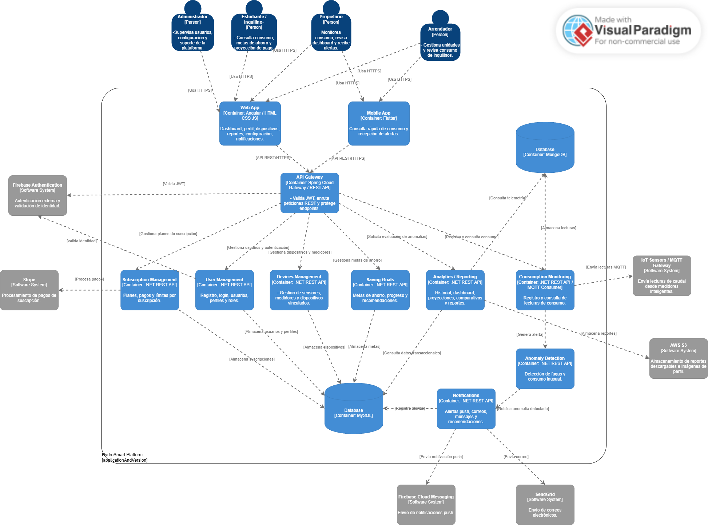

**Diagrama de Componentes de User Management**

El contenedor User Management concentra las responsabilidades de registro, inicio de sesión, gestión de perfiles y validación de roles. Su diseño separa los controladores REST de la lógica de autenticación, perfil y roles, además de utilizar un adaptador para comunicarse con Firebase Authentication.

El sistema se estructura en los siguientes bloques y componentes principales:

- **Puntos de Entrada (Controllers):** El servicio expone interfaces HTTP en la capa de presentación para recibir solicitudes enrutadas desde el API Gateway.
  - **Authentication Controller:** Expone los endpoints REST para registro e inicio de sesión de usuarios.
  - **User Controller:** Permite consultar y gestionar usuarios, perfiles y roles asociados a la cuenta.
- **Lógica de Aplicación Especializada:** La lógica de identidad se separa en servicios especializados para mantener responsabilidades claras.
  - **Authentication Service:** Orquesta el proceso de autenticación y sesión del usuario, delegando la validación de identidad al adaptador de Firebase.
  - **Profile Service:** Administra los datos de perfil y preferencias del usuario.
  - **Role Service:** Valida los permisos según el rol registrado: propietario, inquilino o administrador.
- **Persistencia y Adaptadores de Infraestructura:** El núcleo de identidad se mantiene desacoplado de proveedores externos y almacenamiento.
  - **Firebase Auth Adapter:** Encapsula la comunicación con Firebase Authentication para validar credenciales y tokens JWT.
  - **User Repository:** Persiste usuarios, perfiles y roles en MySQL, evitando que la lógica de aplicación dependa directamente de consultas SQL.

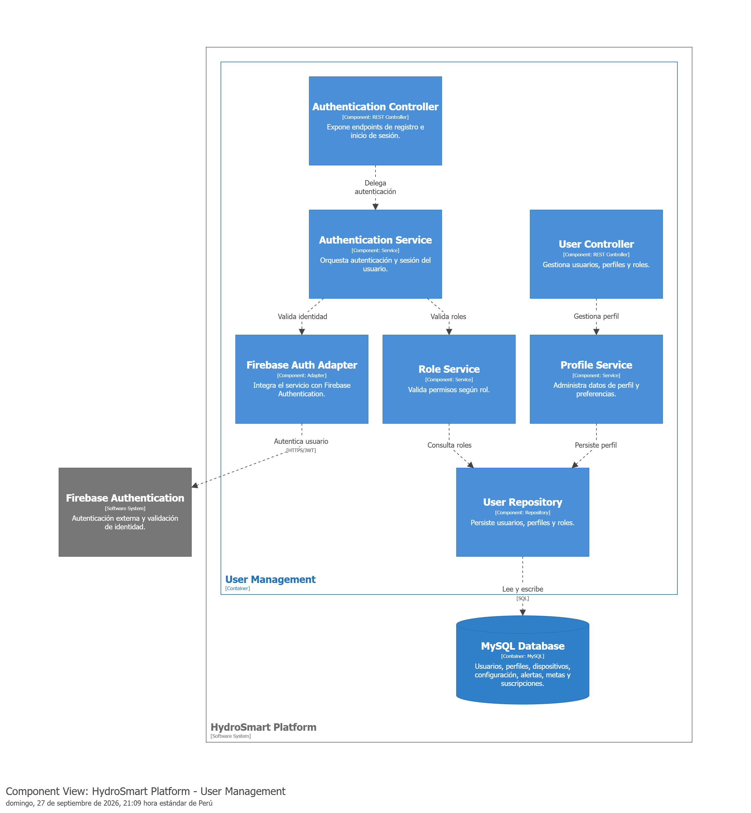

**Diagrama de Componentes de Consumption Monitoring**

El contenedor Consumption Monitoring representa el flujo principal de recepción y consulta de lecturas de consumo. Las lecturas provenientes del gateway MQTT son recibidas por un worker de ingesta, normalizadas por el servicio de consumo y persistidas en MongoDB como series de tiempo. Además, el servicio consulta la información de dispositivos vinculados y solicita la evaluación de anomalías cuando corresponde.

El sistema se estructura en los siguientes bloques y componentes principales:

- **Puntos de Entrada:** El contenedor recibe tanto solicitudes síncronas desde clientes como lecturas provenientes de sensores.
  - **Consumption Controller:** Expone endpoints REST para consultar consumo actual, histórico y datos asociados al dashboard.
  - **Telemetry Ingestion Worker:** Recibe lecturas enviadas por el gateway MQTT y las entrega al servicio de consumo para su validación.
- **Lógica de Aplicación Especializada:** El procesamiento de lecturas se concentra en servicios que validan el origen, normalizan datos y coordinan acciones posteriores.
  - **Consumption Service:** Valida, normaliza y registra lecturas de consumo recibidas desde sensores o consultas internas.
  - **Device Lookup Service:** Verifica que el medidor, vivienda o unidad exista y se encuentre correctamente vinculado al usuario correspondiente.
  - **Anomaly Detection Client:** Solicita al contenedor Anomaly Detection la evaluación de posibles fugas o consumos inusuales.
- **Persistencia e Integración de Telemetría:** La información de consumo se almacena separando datos transaccionales y datos de series de tiempo.
  - **Telemetry Repository:** Persiste lecturas de consumo en MongoDB como series de tiempo, permitiendo consultas históricas y análisis posterior.
  - **MySQL Database:** Se consulta para validar dispositivos, viviendas, unidades y relaciones de propiedad.

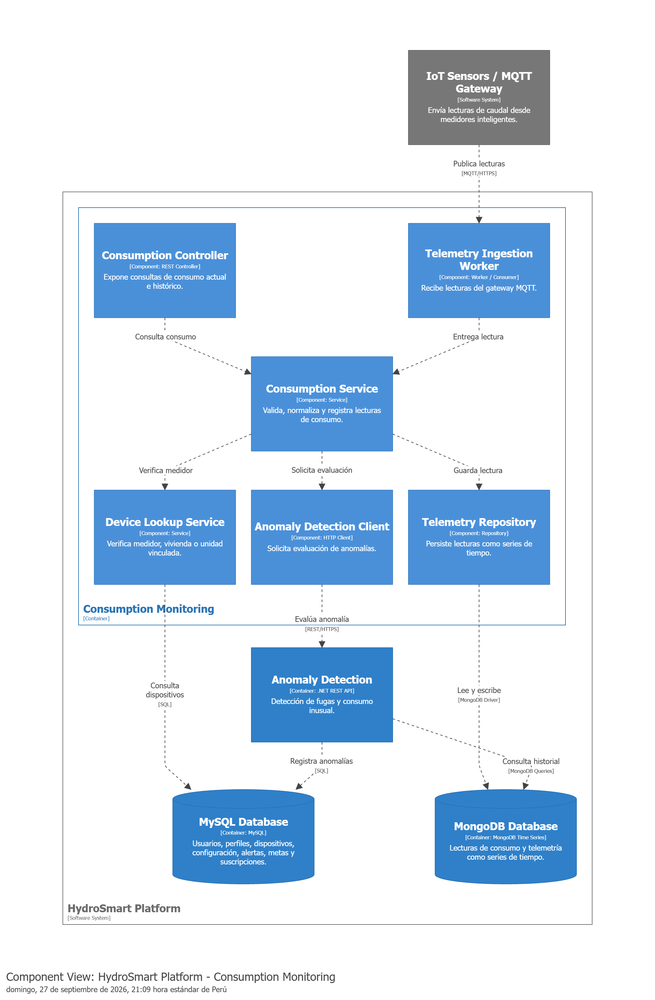

**Diagrama de Componentes de Anomaly Detection**

El contenedor Anomaly Detection evalúa umbrales, patrones históricos y reglas configurables para identificar consumos inusuales o posibles fugas. Cuando se detecta una anomalía, el servicio registra el resultado y solicita al contenedor Notifications el envío de una alerta al usuario.

El sistema se estructura en los siguientes bloques y componentes principales:

- **Punto de Entrada (Controller):** El servicio expone una interfaz para recibir solicitudes de evaluación desde otros contenedores.
  - **Anomaly Controller:** Expone operaciones REST para evaluar lecturas de consumo y consultar resultados de anomalías detectadas.
- **Lógica de Aplicación Especializada:** La detección se organiza en componentes que separan reglas, comparación histórica y decisión final.
  - **Anomaly Detection Service:** Coordina la evaluación de lecturas, aplica criterios de detección y determina si existe una fuga o consumo inusual.
  - **Detection Rule Engine:** Aplica reglas configurables de detección, como umbrales máximos, consumo continuo o comportamiento fuera del horario habitual.
  - **Consumption Baseline Service:** Compara las lecturas actuales contra patrones históricos para reducir falsos positivos.
- **Persistencia y Comunicación con Otros Contenedores:** Los resultados se registran y se comunican a los servicios responsables de alertar al usuario.
  - **Anomaly Repository:** Registra anomalías detectadas, estado de atención y evidencia asociada en MySQL.
  - **Notification Client:** Solicita al contenedor Notifications el envío de alertas cuando se confirma una anomalía.
  - **MongoDB Database:** Provee lecturas históricas utilizadas para construir la línea base de consumo.

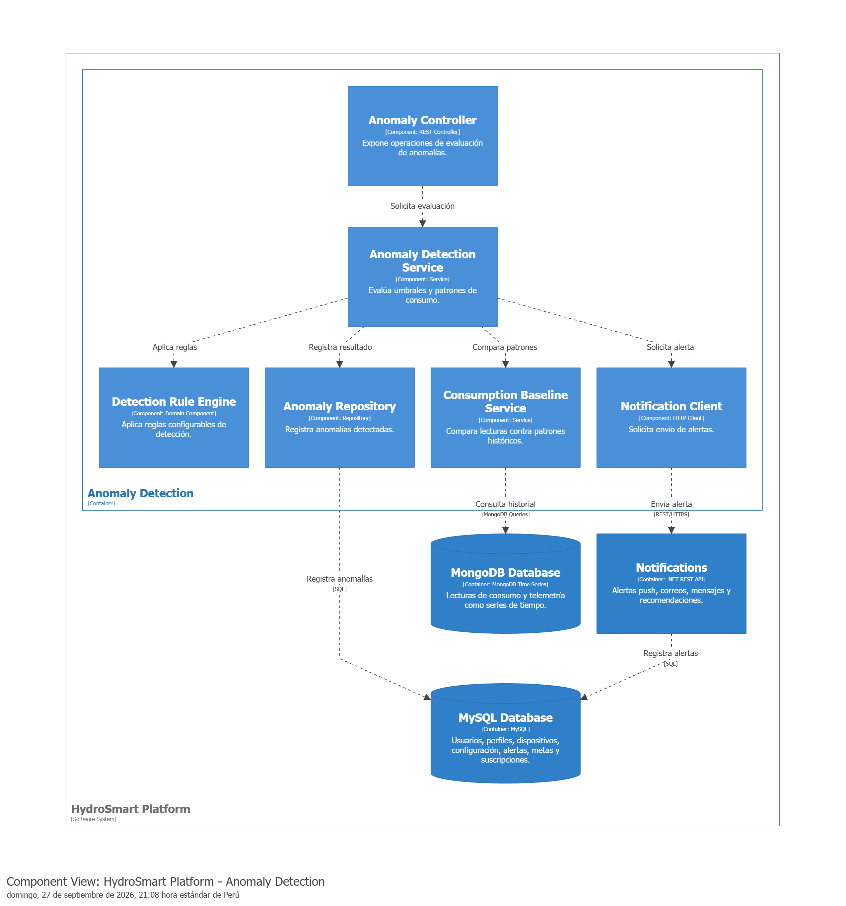

**Diagrama de Componentes de Notifications**

El contenedor Notifications gestiona el envío y registro de alertas, mensajes y recomendaciones. Para ello utiliza adaptadores específicos hacia Firebase Cloud Messaging y SendGrid, manteniendo la lógica de notificación desacoplada de los proveedores externos.

El sistema se estructura en los siguientes bloques y componentes principales:

- **Punto de Entrada (Controller):** El servicio expone endpoints para consultar y administrar las notificaciones del usuario.
  - **Notification Controller:** Permite recuperar alertas, revisar mensajes y actualizar estados de notificación desde la Web App o Mobile App.
- **Lógica de Aplicación Especializada:** El envío de mensajes se centraliza en un servicio que decide el canal y aplica preferencias del usuario.
  - **Notification Service:** Orquesta alertas, mensajes y recomendaciones, seleccionando si corresponde enviar una notificación push, correo electrónico o registrar únicamente el evento.
- **Adaptadores y Persistencia:** La comunicación externa se encapsula mediante adaptadores para evitar acoplamiento directo con proveedores.
  - **Firebase Cloud Messaging Adapter:** Envía notificaciones push hacia la Mobile App mediante Firebase Cloud Messaging.
  - **SendGrid Email Adapter:** Envía correos electrónicos cuando se requiere un canal complementario o de respaldo.
  - **Notification Repository:** Registra alertas enviadas, estados y trazabilidad de eventos importantes como fugas, consumos inusuales o metas próximas a alcanzarse.

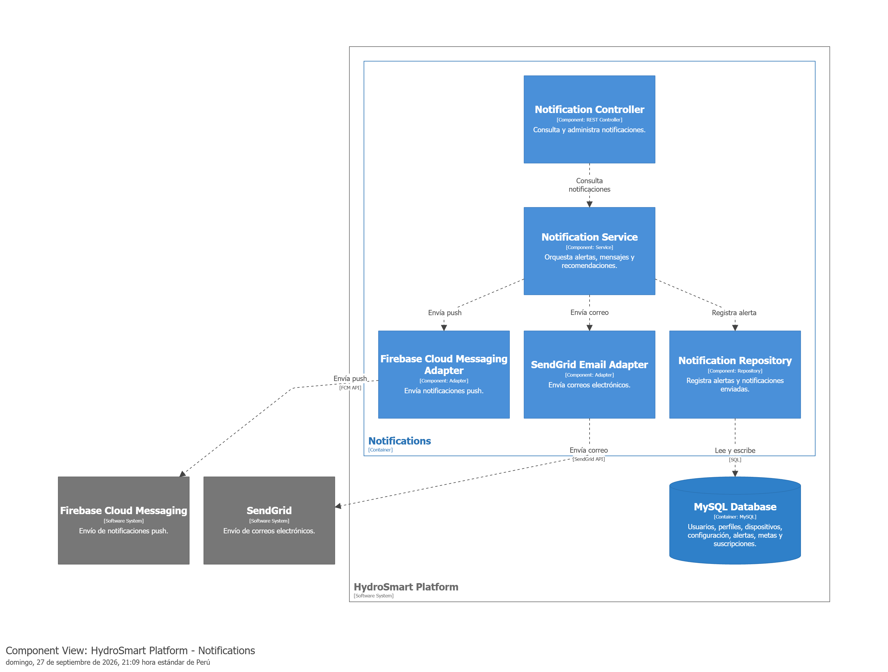

**Diagrama de Componentes de Analytics / Reporting**

El contenedor Analytics / Reporting permite consultar el dashboard, generar reportes, estimar proyecciones mensuales y recuperar lecturas históricas. Este contenedor utiliza MySQL para consultar información transaccional, MongoDB para acceder a telemetría histórica y AWS S3 para almacenar reportes descargables.

El sistema se estructura en los siguientes bloques y componentes principales:

- **Punto de Entrada (Controller):** El servicio expone endpoints de lectura para dashboards, historiales, comparativos y reportes.
  - **Analytics Controller:** Recibe solicitudes de visualización de métricas, historial de consumo y generación de reportes.
- **Lógica de Consulta y Reportes:** Las operaciones se orientan principalmente a lectura y generación de información consolidada.
  - **Dashboard Query Service:** Consolida datos de consumo, metas y proyecciones para alimentar el dashboard del usuario.
  - **Monthly Projection Service:** Calcula la proyección mensual de consumo y gasto estimado a partir de las lecturas históricas.
  - **Report Generation Service:** Genera reportes descargables por periodo, vivienda o unidad, útiles para revisión del consumo y evidencia ante disputas.
- **Persistencia y Adaptadores de Infraestructura:** El contenedor consulta datos desde distintas fuentes y delega el almacenamiento de archivos generados.
  - **Analytics Repository:** Consulta información transaccional en MySQL, como usuarios, dispositivos, metas y configuraciones.
  - **Telemetry Query Repository:** Consulta lecturas históricas en MongoDB para construir gráficos, comparativos y proyecciones.
  - **AWS S3 Adapter:** Almacena reportes descargables en AWS S3, evitando guardar archivos pesados dentro de la base de datos transaccional.

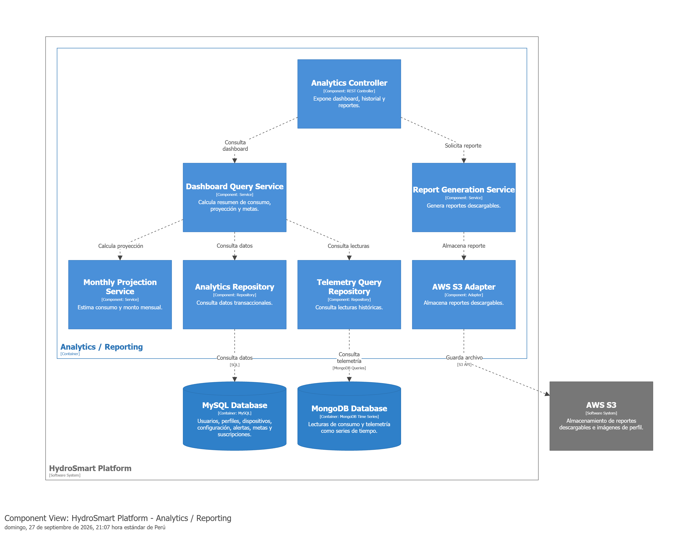

**Diagrama UML de detección de fuga**

Como complemento a las vistas C4, se utiliza una vista UML del flujo de detección de fuga. Esta vista describe cómo una lectura enviada por sensores IoT puede ser registrada por el sistema, evaluada como posible anomalía y finalmente comunicada al usuario mediante una notificación.

El flujo inicia cuando el sensor o gateway IoT envía una lectura de consumo hacia el backend. Luego, el módulo de monitoreo registra la lectura, la almacena como telemetría y solicita la evaluación del consumo. Si el módulo de detección identifica una fuga o consumo inusual, se genera una alerta y se deriva al módulo de notificaciones para su entrega al usuario. Esta vista complementa los diagramas de componentes porque muestra la secuencia de colaboración entre contenedores durante uno de los escenarios más importantes del producto.

**Decisiones de Diseño Registradas**

| ID | Decisión de diseño | Justificación |
|---|---|---|
| DD-01 | Centralizar el acceso al backend mediante un API Gateway. | Permite validar JWT, enrutar peticiones REST y mantener un punto único de entrada para la Web App y la Mobile App. |
| DD-02 | Separar la lógica del sistema en contenedores por bounded context. | Reduce el acoplamiento entre funcionalidades como usuarios, dispositivos, consumo, anomalías, reportes, notificaciones, metas y suscripciones. |
| DD-03 | Utilizar MySQL para datos transaccionales. | Los usuarios, perfiles, dispositivos, metas, alertas y suscripciones requieren integridad relacional y consultas estructuradas. |
| DD-04 | Utilizar MongoDB para lecturas de consumo y telemetría. | Las lecturas de sensores se comportan como series de tiempo y pueden crecer rápidamente, por lo que requieren almacenamiento flexible y eficiente. |
| DD-05 | Delegar autenticación a Firebase Authentication. | Reduce la complejidad interna de gestión de credenciales y permite validar identidad mediante tokens JWT. |
| DD-06 | Separar detección de anomalías del registro de consumo. | Permite evolucionar las reglas de detección de fugas sin afectar la ingesta y persistencia de lecturas. |
| DD-07 | Desacoplar notificaciones mediante adaptadores externos. | Facilita el envío de alertas por Firebase Cloud Messaging y correos por SendGrid sin acoplar la lógica de dominio a un proveedor específico. |
| DD-08 | Almacenar reportes descargables en AWS S3. | Evita cargar la base de datos transaccional con archivos y permite gestionar documentos generados de forma escalable. |

#### 4.3.1.7 Analysis of Current Design and Review Iteration Goal (Kanban Board)

Al cierre de la primera iteración del proceso ADD, se revisa el estado del diseño arquitectónico de HydroSmart y se contrasta con el objetivo planteado para la iteración. Esta revisión permite identificar qué decisiones quedaron establecidas, qué elementos de la arquitectura ya cuentan con una responsabilidad clara y qué aspectos deberán refinarse en iteraciones posteriores.

**Revisión del Objetivo de la Iteración**

El objetivo principal de esta primera iteración fue establecer una base arquitectónica que permita soportar las funcionalidades esenciales de HydroSmart: autenticación de usuarios, gestión de dispositivos, registro de consumo, detección de anomalías, notificaciones, visualización de analíticas, metas de ahorro y gestión de suscripciones. Para ello, se definieron los contenedores principales, las interfaces de comunicación y las responsabilidades internas de los servicios más críticos.

La iteración cumple con el objetivo planteado porque la arquitectura ya cuenta con una separación clara entre clientes, API Gateway, servicios backend, persistencia y sistemas externos. Además, las vistas C4 y de componentes permiten justificar cómo cada módulo contribuye a los drivers seleccionados: seguridad, mantenibilidad, performance, monitoreo oportuno y escalabilidad progresiva.

**Revisión del Kanban Board**

| Estado | Elementos revisados | Resultado |
|---|---|---|
| Completado | Definición de contenedores principales, API Gateway, bases de datos y sistemas externos. | La arquitectura cuenta con una vista general suficiente para explicar la distribución de responsabilidades. |
| Completado | Diagramas de componentes de User Management, Consumption Monitoring, Anomaly Detection, Notifications y Analytics / Reporting. | Los contenedores críticos de la primera iteración quedan documentados con sus componentes internos. |
| En progreso | Validación técnica de contratos entre servicios. | Se requiere detallar endpoints, payloads y respuestas esperadas entre los contenedores. |
| En progreso | Integración con sensores IoT y flujo MQTT. | La arquitectura contempla el gateway MQTT, pero debe validarse con lecturas simuladas o reales. |
| Pendiente | Pruebas de rendimiento del dashboard y notificaciones. | Deben ejecutarse en una iteración posterior para comprobar tiempos de respuesta y entrega de alertas. |

**Análisis del Diseño Actual**

Entre las fortalezas identificadas se encuentra la separación del sistema en bounded contexts, lo que facilita que User Management, Devices Management, Consumption Monitoring, Anomaly Detection, Notifications y Analytics / Reporting puedan evolucionar sin concentrar toda la lógica en un único componente. La decisión de mantener un API Gateway como punto de entrada mejora la seguridad y organiza el consumo de servicios desde la Web App y la Mobile App.

Otra fortaleza importante es la separación de persistencia entre MySQL y MongoDB. MySQL se utiliza para datos transaccionales, mientras que MongoDB se reserva para lecturas de consumo y telemetría, lo cual resulta coherente con el volumen y naturaleza temporal de los datos generados por sensores IoT. Asimismo, la integración con servicios externos como Firebase Authentication, Firebase Cloud Messaging, SendGrid, Stripe/Culqi y AWS S3 reduce la complejidad interna y permite concentrar el desarrollo en el dominio principal del producto.

**Áreas de Mejora**

Como áreas de mejora, se identifica la necesidad de validar con mayor detalle las reglas de Anomaly Detection para reducir falsos positivos y asegurar que las alertas generadas sean realmente útiles para el usuario. También será necesario definir con mayor precisión los contratos de API entre los contenedores, especialmente para el flujo de telemetría, reportes y notificaciones. Además, la integración con sensores IoT debe ser probada con datos simulados o reales para confirmar que la arquitectura soporta lecturas continuas sin pérdida de información.

**Conclusión de la Iteración**

La primera iteración establece una base arquitectónica suficiente para continuar con el desarrollo de HydroSmart. Los contenedores principales, sus responsabilidades, las interfaces de comunicación y las decisiones de diseño ya se encuentran documentadas. En las siguientes iteraciones se deberá profundizar en pruebas de integración, refinamiento de reglas de detección, manejo de fallos en servicios externos y validación de rendimiento del dashboard y las notificaciones en escenarios de uso más cercanos a producción.
